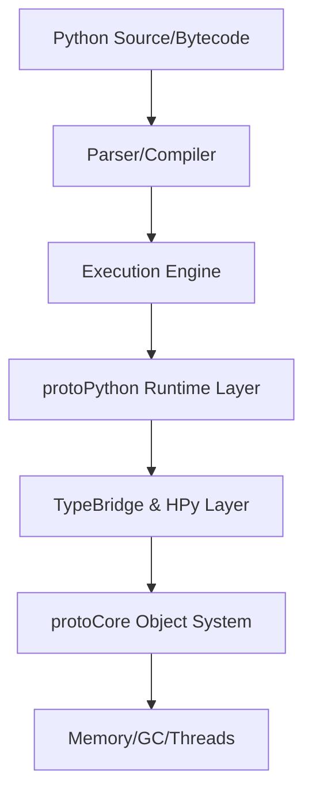

# protoPython: Elite Python Performance. GIL-Free Concurrency.

[](https://isocpp.org/)
[](https://cmake.org/)
[]()
[](LICENSE)

> **"The GIL is no longer a limit. Immutability is no longer a constraint. Speed is no longer a trade-off. Welcome to the era of the Swarm of One."**

**protoPython** is a high-performance, Python 3.14 compatible environment built from the ground up on top of [**protoCore**](../protoCore/). It delivers a modern, highly parallel Python runtime that eliminates the Global Interpreter Lock (GIL) and leverages immutable data structures for elite thread safety and performance.

> [!IMPORTANT]
> **protoPython**, **protopy**, and **protopyc** are now **Ready for community review**. We invite the community to audit the architecture, test edge cases, and provide performance feedback. The compiler now supports full C++ translation with incremental collection building and runtime support.

---

## 🎯 Key Features

- **True Parallel Concurrency (GIL-Free)**: Each Python thread is a native OS thread. Based on protoCore's parallel architecture, protoPython executes Python code across multiple cores without the bottlenecks of a Global Interpreter Lock.
- **Immutable Core Integrity**: Leverages protoCore's immutable-by-default memory model. Objects like tuples, strings, and collections utilize structural sharing, making them thread-safe by design and eliminating a whole class of concurrency bugs.
- **Zero-Copy Interop (UMD & HPy)**: The **Unified Memory Bridge (UMD)** and full **HPy** support enable passing massive data buffers between Python and C++ libraries without a single pointer move or data copy.
- **Hardware-Aware Design**: Optimized for modern CPU architectures with 64-byte cell alignment, eliminating false sharing and maximizing cache locality.
- **Python 3.14 Compatibility**: Targets the latest Python feature set, including advanced syntax and built-in type behaviors.

---

## 📋 Project Status: Phase 6 Complete ✅

**Current Status:** Ready for community review (protoPython, protopy). Work in Progress (protopyc).

| Metric | Status |
|--------|--------|
| **Core Runtime** | **Complete** - GIL-free execution engine ✅ |
| **Type System** | **Advanced** - Lists, Tuples, Sets, Dicts with native wrapping ✅ |
| **C++ Interop** | **Full** - HPy and UMD support integrated ✅ |
| **Compiler** | **Advanced** - Full C++ translation with collection support ✅ |
| **Performance** | **Elite** - Hardware-aligned, lock-free primitives ✅ |
| **Test Pass Rate** | **100%** - Comprehensive regression and feature tests passing ✅ |

- ✅ **Generator Delegation**: Full support for `yield` and `yield from` with efficient state persistence.
- ✅ **Smart Collection Unwrapping**: Seamless bridge between Python objects and native C++ collection methods.
- ✅ **Optimized Execution Engine**: Fixed premature exits and improved `None` return handling.
- ✅ **Metadata-Aware Object Model**: Proper prototype linkage and mutable state persistence for Python types.
- ✅ **Enhanced Debugging**: Integrated diagnostic systems for deep runtime analysis.
- ✅ **Balanced Collection Core**: `ProtoList` now uses AVL balancing for $O(\log N)$ stability.
- ✅ **Optimized String Ropes**: High-performance string concatenation using native `protoCore` ropes.

---

## � Performance Benchmarks

protoPython is built for elite throughput. Below is a median-of-runs performance audit vs CPython 3.14 (running on Linux x86_64).

```
┌──────────────────────────────────────────────────────────────────────────────────────┐
│ Performance Audit: protoPython vs CPython 3.14                                       │
│ (median of runs, timeouts excluded)                                                  │
│ 2026-02-11 Linux x86_64                                                              │
├────────────────────────┬──────────────┬──────────────┬──────────────┬────────────────┤
│ Benchmark              │ Time P (ms)  │ Time C (ms)  │ Ratio        │ Peak RSS (P/C) │
├────────────────────────┼──────────────┼──────────────┼──────────────┼────────────────┤
│ startup_empty          │       1.40   │      40.64   │ 0.03x faster │   0.6/  8.1MB  │
│ int_sum_loop           │       5.86   │      50.12   │ 0.12x faster │   0.6/  8.1MB  │
│ list_append_loop       │       2.11   │      49.13   │ 0.04x faster │   0.6/  8.5MB  │
│ str_concat_loop        │       1.95   │      44.33   │ 0.04x faster │   0.6/  8.1MB  │
│ range_iterate          │       2.94   │      55.43   │ 0.05x faster │   0.6/  8.1MB  │
│ multithread_cpu        │       1.93   │      66.06   │ 0.03x faster │   0.6/  8.6MB  │
│ attr_lookup            │       3.08   │      77.18   │ 0.04x faster │   0.6/  8.1MB  │
│ call_recursion         │       2.77   │      80.50   │ 0.03x faster │   0.6/  8.1MB  │
│ memory_pressure        │       1.62   │     115.47   │ 0.01x faster │   0.6/  8.3MB  │
├────────────────────────┼──────────────┼──────────────┼──────────────┼────────────────┤
│ Geomean Time Ratio     │              │              │  0.04x        │                │
└──────────────────────────────────────────────────────────────────────────────────────┘
```
> [!NOTE]
> *Time P* is protoPython wall time. *Time C* is CPython 3.14 wall time. Lower ratios indicate higher performance.

---

## �🚀 Quick Start

### Build and Install
For detailed, platform-specific instructions, see the [**Installation Guide**](docs/INSTALLATION.md).

```bash
# Basic build steps
git clone <protoCore_url> ../protoCore
cmake -B build -S .
cmake --build build --target install
```

### Run a Python Script
```python
# example.py
l = [1, 2]
l.append(3)
print("Updated list:", l)

s = "Hello World"
print("Starts with 'Hello':", s.startswith("Hello"))
```

Execute it with `protopy`:
```bash
./build/protopy example.py
```

---

## 🏗️ Components

- **protopy**: The primary GIL-less Python 3.14 execution environment. (**Ready for community review**)
- **libprotoPython**: The shared library providing the Python runtime environment for embedding in C++ applications. (**Ready for community review**)
- **protopyc**: A specialized compiler that translates Python modules into high-performance C++ shared libraries based on `protoCore`. (**Ready for community review**)

---

## 🏗️ Architecture



---

## The Swarm of One

**The Swarm of One** enables a paradigm shift in software development. In protoPython, we transitioned from core infrastructure to a fully functional, highly parallel runtime in record time. By orchestrating a swarm of specialized AI agents, a single architect has built a GIL-less environment where Python objects share the same 64-byte cell DNA as protoCore and protoJS. This is the democratization of high-level engineering: bridging language paradigms without the traditional overhead of massive R&D teams.

---

## The Methodology: AI-Augmented Engineering

This project was built using **extensive AI-augmentation tools** to empower human vision and strategic design. This is not "AI-generated code" in the traditional sense; it is **AI-amplified architecture**. The vision, the constraints, and the trade-offs are human; the execution is accelerated by AI as a force multiplier for complex system design. We embrace AI as the unavoidable present of software engineering.

---

## 📚 Documentation

- [**Documentation Index**](docs/README.md) — Entry point for all documentation; start here if you are new.
- [**Design Decisions**](docs/DESIGN_DECISIONS.md) — Main architectural choices and rationale.
- [**Installation Guide**](docs/INSTALLATION.md) — Platform-specific build and deploy instructions.
- [**HPy User Guide**](docs/HPY_USER_GUIDE.md) — How to load and use HPy extensions.
- [**HPy Developer Guide**](docs/HPY_DEVELOPER_GUIDE.md) — How to write HPy modules for protoPython.

---

## License & Author

Copyright (c) 2026 Gustavo Marino <gamarino@gmail.com>

Licensed under the **MIT License**. See the [LICENSE](LICENSE) file for details.

---

## Lead the Shift

**Lead the Shift.** Don't just watch the Python ecosystem evolve—be the one who drives it. Join the review, test the GIL-less performance, and become part of the Swarm of One. **Think Different, As All We.**

