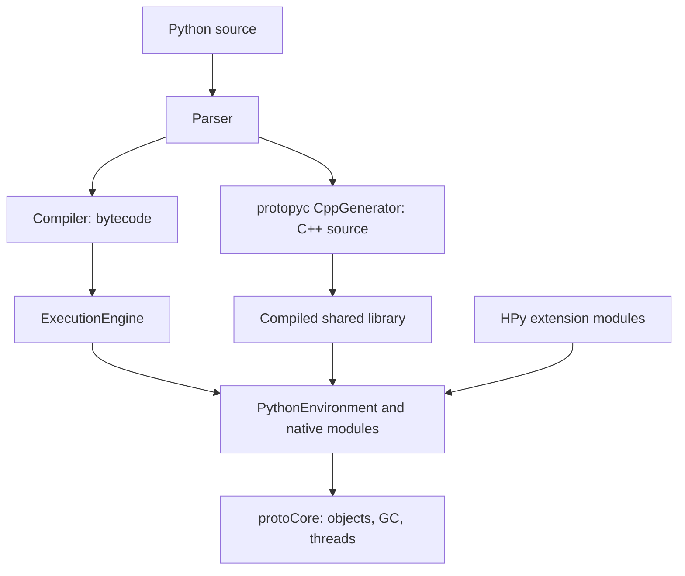

# protoPython: GIL-Free Python 3.14 Runtime

[](https://isocpp.org/)
[](https://cmake.org/)
[](CHANGELOG.md)
[](#project-status)
[](LICENSE)

**protoPython** is a Python runtime built on
[**protoCore**](https://github.com/numaes/protoCore). It targets Python 3.14
semantics, ships the CPython 3.14 pure-Python standard library in
`lib/python3.14/`, and runs without a Global Interpreter Lock: Python threads are
native OS threads created through protoCore's `ProtoSpace::newThread`
(`src/library/ThreadModule.cpp`), and collections are built on protoCore's
immutable, structurally shared data structures.

protoPython provides three components:

- **protopy** — the command-line runtime: source is parsed, compiled to bytecode and
  executed by the `ExecutionEngine`.
- **protopyc** — an ahead-of-time compiler that translates Python modules into C++
  source and shared libraries that call into the same runtime.
- **libprotoPython** — the shared library behind both, for embedding in C++
  applications.

---

## Project Status

- **Version:** 1.0.0 (`CMakeLists.txt`, tag `v1.0.0`).
- **Maturity:** not production ready. The project is open for community review.
- **Tests:** the CTest suite has 344 tests; all pass in a Release build (2026-09-15).
- **protopy:** under active conformance work (see below).
- **protopyc:** experimental, with known limitations. Several correctness bugs in
  generated code were fixed in 2026 (for example, loop-target scoping and thread
  globals in commit `eab663bd`, and `and`/`or` lowering in commit `1084f969`);
  check the results of compiled modules against `protopy` before relying on them.

### CPython conformance

[docs/CPYTHON_CONFORMANCE.md](docs/CPYTHON_CONFORMANCE.md) records the current
status (2026-09-14). Conformance work runs the same script under `python3` and
`protopy`, diffs the outputs, and fixes each defect in a commit that adds a
regression test under `test/regression/`. Recent fixes include PEP 695 generics,
zero-argument `__class__` in methods, `import asyncio`, `nonlocal` rebinding and
`@dataclass(slots=True)`.

Its [known divergences](docs/CPYTHON_CONFORMANCE.md#known-divergences-pending)
list what is still pending, for example:

- "`frozen=True` fails in `__init__`" for dataclasses;
- "`inspect.getclosurevars` fails because `dis` cannot decode protoPython bytecode";
- "`gc.collect()` is a no-op (protoCore collects under heap pressure only)";
- "sets and dicts treat two distinct keys with equal hashes as the same key
  (accepted limitation)".

Earlier conformance reports, including the `test_descr.py` work, are kept in
[docs/archive/CPYTHON_CONFORMANCE_HISTORY.md](docs/archive/CPYTHON_CONFORMANCE_HISTORY.md).

---

## Key Features

- **No GIL.** Each Python thread is a native OS thread, and threads run Python code in
  parallel. protoCore provides per-thread allocation arenas and a concurrent garbage
  collector.
- **Immutable core structures.** Lists, tuples, strings and dictionaries are backed by
  protoCore's structurally shared collections (AVL trees and ropes). List mutators
  publish their new state atomically across threads (commit `1614224f`).
- **Two execution modes, one runtime.** `protopy` interprets bytecode; `protopyc`
  compiles modules to C++ ahead of time. Both call the same `libprotoPython` runtime.
- **HPy-style extensions.** `import` loads extension modules written against
  protoPython's HPy-style C++ API (a subset, not the HPy universal ABI); see
  [docs/HPY_USER_GUIDE.md](docs/HPY_USER_GUIDE.md).
- **Embedding.** `PythonEnvironment` exposes the runtime to C++ applications; see
  [docs/CPP_API_REFERENCE.md](docs/CPP_API_REFERENCE.md).

Supported syntax, built-in types and modules, and differences from CPython are
described in [docs/PYTHON_COMPATIBILITY.md](docs/PYTHON_COMPATIBILITY.md).

---

## Quick Start

### Build

protoPython builds protoCore from a sibling `../protoCore` checkout unless
`PROTO_CORE_PREFIX` points to an installed protoCore (`CMakeLists.txt`). For
platform-specific instructions, install prefixes and library paths, see the
[**Installation Guide**](docs/INSTALLATION.md).

```bash
git clone https://github.com/gamarino/protoPython.git
git clone https://github.com/numaes/protoCore.git
cd protoPython

cmake -B build -S . -DCMAKE_BUILD_TYPE=Release
cmake --build build

# Run the test suite
ctest --test-dir build --output-on-failure
```

Use a Release build for any performance measurement.

**Running without installing:** RPATH is set, so the executables find the shared
libraries from the build tree without `LD_LIBRARY_PATH`. See
[Running from the build tree](docs/INSTALLATION.md#running-from-the-build-tree).

### Run a Python script

```python
# example.py
l = [1, 2]
l.append(3)
print("Updated list:", l)

s = "Hello World"
print("Starts with 'Hello':", s.startswith("Hello"))
```

```bash
./build/src/runtime/protopy example.py
# Updated list: [1, 2, 3]
# Starts with 'Hello': True
```

### Command line

| Invocation | Effect |
|---|---|
| `protopy script.py` | Run a script. |
| `protopy -c "<code>"` | Run a program passed as a string. |
| `protopy -m <module>` | Run a module as a script. |
| `protopy -i` / `protopy --repl` | Start the interactive REPL. |
| `protopy -p <dir>` / `--path <dir>` | Append a module search path (repeatable). |
| `protopy --help` | Show all options. |

The environment variable `PROTO_PYTHONPATH` adds module search paths. Running
`protopy` with no arguments prints the usage text and exits with status 64.

Exit status: `0` on success, `64` for a usage error, `65` when the script or module
cannot be resolved, `70` for an unhandled runtime failure, and `n` when the program
raises `SystemExit(n)` (also with `-c`).

### Compile a module with protopyc

```bash
./build/src/compiler/protopyc example.py --build-so
```

`protopyc <source_path>` accepts `--emit-cpp` (C++ sources and headers only),
`--emit-make` (C++ sources plus a Makefile) and `--build-so` (the full pipeline, up to
a shared library). See [docs/PROTOPYC_SPECIFICATION.md](docs/PROTOPYC_SPECIFICATION.md).

---

## Performance

protoPython is slower than CPython on most single-threaded workloads. The most recent
full measurement is
[benchmarks/reports/2026-06-16-full-stack-cpp-proto-python.md](benchmarks/reports/2026-06-16-full-stack-cpp-proto-python.md),
produced by [benchmarks/run_full_stack.py](benchmarks/run_full_stack.py).

**Method (as stated by the report and the harness):**

- Baseline 1.0 = CPython 3.14t (free-threading, GIL off). `cp` and `cpt` are
  CPython 3.14 with the GIL on and off (uv builds).
- Python variants report inner time, parsed from the `BENCH_RESULT ms=` line each
  benchmark prints; this excludes interpreter startup and the GC tail. protoCpp
  binaries report wall-clock time.
- Every variant of a benchmark uses the same workload size, matching the
  [protoCpp](https://github.com/gamarino/protoCpp) benchmarks: `int_sum_loop`
  N = 10,000,000; `attr_lookup` N = 5,000,000; `list_append_loop` N = 10,000;
  `str_concat_loop` N = 2,000; `call_recursion` N = 25; `multithread_cpu`
  4 threads × 2,000,000 iterations.
- Binaries run interleaved: one warm-up run, then three measured runs; the median is
  reported.

Columns: `cpp` pure C++ (no protoCore); `proto` protoCore driven directly from C++;
`proto_fast` protoCore with API-side optimisations; `protopy` the protoPython bytecode
interpreter; `protopyc` protoPython compiled to C++.

**Absolute time (ms), 2026-06-16:**

| Bench | cpp | proto | proto_fast | cp | cpt | protopy | protopyc |
|---|---:|---:|---:|---:|---:|---:|---:|
| int_sum_loop | 4.72 | 105.60 | 56.69 | 413.98 | 541.22 | 672.41 | N/A |
| attr_lookup | 6.80 | 300.94 | N/A | 389.44 | 372.59 | 2703.94 | 5022.64 |
| list_append_loop | 3.20 | 17.50 | N/A | 0.66 | 0.96 | 18.73 | 21.89 |
| str_concat_loop | 2.54 | 14.93 | N/A | 0.15 | 0.09 | 4.09 | 91.62 |
| call_recursion | 1.49 | 34.74 | 15.43 | 9.40 | 10.16 | 74.09 | 34.24 |
| multithread_cpu | 3.68 | 35.33 | 26.19 | 563.88 | 160.63 | 307.03 | 0.74 † |

**Ratios vs CPython 3.14t, 2026-06-16** (lower is faster):

| Bench | cpp | proto | proto_fast | cp | cpt | protopy | protopyc |
|---|---:|---:|---:|---:|---:|---:|---:|
| int_sum_loop | 0.01x | 0.20x | 0.10x | 0.76x | 1.00x | 1.24x | N/A |
| attr_lookup | 0.02x | 0.81x | N/A | 1.05x | 1.00x | 7.26x | 13.48x |
| list_append_loop | 3.34x | 18.23x | N/A | 0.69x | 1.00x | 19.51x | 22.80x |
| str_concat_loop | 28.20x | 165.84x | N/A | 1.67x | 1.00x | 45.44x | 1017.99x |
| call_recursion | 0.15x | 3.42x | 1.52x | 0.93x | 1.00x | 7.29x | 3.37x |
| multithread_cpu | 0.02x | 0.22x | 0.16x | 3.51x | 1.00x | 1.91x | 0.00x † |
| **Geomean** | **0.19x** | **2.67x** | **0.30x** | **1.20x** | **1.00x** | **6.94x** | 5.47x † |

† **The protopyc column of this report is not a valid measurement.** Commit
`ba763167`, which brought these figures into the README, records the column as
"unreliable: silent failures on 3 of 6 benches". Commit `eab663bd` identifies the causes: a for-loop target scoping bug
in generated functions, and spawned threads that raised on every global lookup and
"died before any side effect". The 0.74 ms `multithread_cpu` figure therefore does
not measure the workload, and the 5.47x geomean includes it.

### Changes measured after this report

These figures come from the commit messages that introduced the changes; no dated
report reproduces them.

- **Peephole specialiser (commit `48d81bbd`, 2026-06-16).** A post-codegen pass fuses
  three loop-shaped opcode sequences into single opcodes with an inline small-integer
  fast path. Setting `PROTOPY_NO_PEEPHOLE=1` disables it for A/B comparison on the
  same binary. The commit reports, vs CPython 3.14t: `int_sum_loop` 1.15x → 0.76x,
  `multithread_cpu` 1.68x → 0.41x, `call_recursion` 6.74x → 6.07x, `attr_lookup`
  6.30x → 5.83x, `list_append_loop` 20.46x → 20.15x, `str_concat_loop`
  50.25x → 49.88x; geomean 6.62x → 4.72x.
- **protopyc fixes (commit `eab663bd`, 2026-06-16).** The commit reports protopyc
  readings vs CPython 3.14t of 0.92x (`int_sum_loop`), 3.95x (`attr_lookup`), 19.11x
  (`list_append_loop`), 972x (`str_concat_loop`) and 4.00x (`call_recursion`);
  `multithread_cpu` still hung. Commit `1084f969` later fixed the `and`/`or` lowering
  that broke that benchmark's spin-wait; it records no new measurement.

### Reading older reports

Dated snapshots are kept in [benchmarks/reports/](benchmarks/reports/). They are
records of their date, not current figures. Keep in mind:

- In some earlier reports, protopyc builds skipped `main()` in scripts that import
  `_thread`, so protopyc `multithread_cpu` figures of about 23–31 ms measure module
  initialisation only
  ([2026-06-15-sprint8-4way-honest.md](benchmarks/reports/2026-06-15-sprint8-4way-honest.md)).
- Until commit `bd6bd4f0` (2026-09-15), protopy called a script's `main()` a second
  time after the script finished. protopy wall-clock and RSS figures in earlier
  reports include that extra run; `BENCH_RESULT` inner timings, such as those in the
  2026-06-16 report, are unaffected.
- Some earlier reports and README revisions labelled the CPython baseline
  "free-threading" while using the GIL-enabled `python3.14`; the README text added in
  commit `e2149f49` records the correction.

---

## How protopyc Translates Python to C++

`protopyc` lowers each Python expression to C++ that calls the protoPython runtime.
For arithmetic on two operands, `CppGenerator::generateBinOp` emits a lambda that
checks whether both operands are small integers, computes the result inline, and
otherwise falls back to `env->binaryOp`, the runtime's generic binary-operation entry
point. Multiplication uses `__builtin_mul_overflow` so that an overflowing product
takes the fallback path.

The generator code, from `src/compiler/CppGenerator.cpp` (lines 590–613):

```cpp
    if (arithOp) {
        *out_ << "([&]() -> const proto::ProtoObject* {\n";
        *out_ << "        const proto::ProtoObject* __a = ";
        if (!generateNode(n->left.get())) return false;
        *out_ << ";\n";
        *out_ << "        const proto::ProtoObject* __b = ";
        if (!generateNode(n->right.get())) return false;
        *out_ << ";\n";
        *out_ << "        if (__a && __b && __a->isInteger(ctx) && __b->isInteger(ctx)) {\n";
        *out_ << "            long __va = __a->asLong(ctx);\n";
        *out_ << "            long __vb = __b->asLong(ctx);\n";
        if (needsOverflowGuard) {
            *out_ << "            long __vr;\n";
            *out_ << "            if (!__builtin_mul_overflow(__va, __vb, &__vr)) return ctx->fromInteger(__vr);\n";
        } else {
            *out_ << "            return ctx->fromInteger(__va " << arithOp << " __vb);\n";
        }
        *out_ << "        }\n";
        *out_ << "        return ";
        emitFallback();
        *out_ << ";\n";
        *out_ << "    })()";
        return true;
    }
```

`arithOp` is set for `+`, `-` and `*`; `needsOverflowGuard` is set only for `*`.
Comparisons (`==`, `!=`, `<`, `<=`, `>`, `>=`) follow the same pattern in the branch
that follows.

---

## Architecture


```mermaid
graph TD
    A[Python source] --> B[Parser]
    B --> C[Compiler: bytecode]
    B --> H[protopyc CppGenerator: C++ source]
    C --> D[ExecutionEngine]
    H --> I[Compiled shared library]
    D --> E[PythonEnvironment and native modules]
    I --> E
    J[HPy extension modules] --> E
    E --> F[protoCore: objects, GC, threads]
```

The corresponding headers are in `include/protoPython/` (`Parser.h`, `Compiler.h`,
`ExecutionEngine.h`, `CppGenerator.h`, `PythonEnvironment.h`, `HPyContext.h`).
[DESIGN.md](DESIGN.md) and [docs/INTERNALS_DEEP_DIVE.md](docs/INTERNALS_DEEP_DIVE.md)
describe the design in detail.

---

## Documentation

- [**Documentation index**](docs/README.md) — every current document, dated analyses
  and the archive.
- [**Installation Guide**](docs/INSTALLATION.md) — building and installing from source.
- [**User Guide**](docs/USER_GUIDE.md) — `protopy` usage, threads without a GIL,
  troubleshooting.
- [**Python Compatibility**](docs/PYTHON_COMPATIBILITY.md) — supported features and
  differences from CPython.
- [**CPython Conformance**](docs/CPYTHON_CONFORMANCE.md) — current status and known
  divergences.
- [**C++ API Reference**](docs/CPP_API_REFERENCE.md) — embedding and native extensions.
- [**protopyc Specification**](docs/PROTOPYC_SPECIFICATION.md) — the ahead-of-time
  compiler.
- [**HPy User Guide**](docs/HPY_USER_GUIDE.md) — the HPy bridge and its current
  limitations.
- [**GC Bridging**](docs/GC_BRIDGING.md) — keeping protoCore objects alive across
  boundaries the garbage collector cannot see.
- [**Changelog**](CHANGELOG.md) — notable changes by release.

---

## The proto Ecosystem

Four language runtimes (protoJS, protoPython, protoST, protoClojure) and protoCpp's C++
examples are built on protoCore.

| Project | Role | Repository |
|---|---|---|
| protoCore | C++20 object model and runtime kernel: immutable structures, concurrent GC, GIL-free threads | https://github.com/numaes/protoCore |
| protoJS | JavaScript runtime on protoCore | https://github.com/gamarino/protoJS |
| protoPython | Python 3 runtime (protopy) and ahead-of-time compiler (protopyc) on protoCore | https://github.com/gamarino/protoPython |
| protoST | Smalltalk-inspired actor language on protoCore | https://github.com/gamarino/protoST |
| protoClojure | Clojure dialect on protoCore (early stage) | https://github.com/gamarino/protoClojure |
| protoCpp | Examples and benchmarks using protoCore directly from C++ | https://github.com/gamarino/protoCpp |

---

## Contributing

Contributions are welcome. Read [CONTRIBUTING.md](CONTRIBUTING.md) first, and
[docs/GC_BRIDGING.md](docs/GC_BRIDGING.md) before changing native code that holds
`ProtoObject` pointers.

- Pick a target from the
  [known divergences](docs/CPYTHON_CONFORMANCE.md#known-divergences-pending) or from
  the slow benchmarks above.
- Run the full CTest suite before submitting; every change must keep it passing.
- Add a regression test for each fixed defect.
- Describe what was broken, the root cause, the change and how it was verified.
  Commits [`d0795617`](https://github.com/gamarino/protoPython/commit/d0795617) and
  [`dc8168e6`](https://github.com/gamarino/protoPython/commit/dc8168e6) follow that
  format.

---

## The Swarm of One

protoPython is designed and maintained by a single architect, Gustavo Marino, working
with AI coding agents that draft code, tests and documentation under human review.
As of 2026-09-15, more than 1,000 of the repository's commits carry a
`Co-Authored-By` trailer naming the agent involved. The runtime shares its object
model, garbage collector and threading with protoJS, protoST and protoClojure through
protoCore.

**Think Different, As All We.**

---

## License

Copyright (c) 2023-2026 Gustavo Marino. Released under the MIT License; see
[LICENSE](LICENSE).
