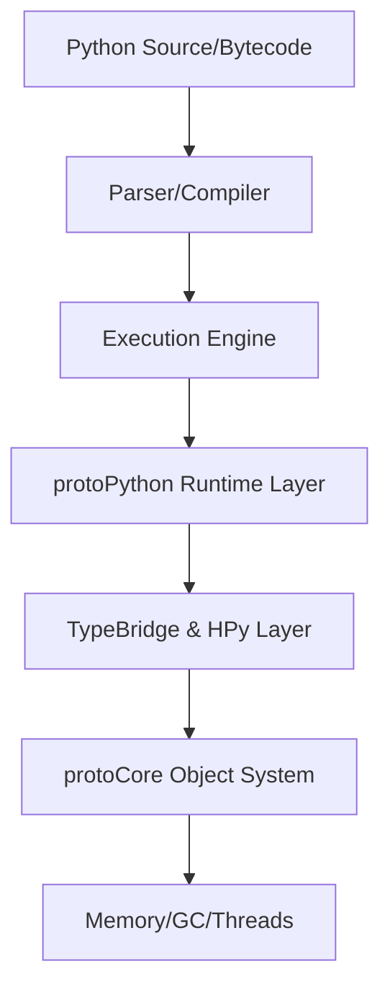

# protoPython: GIL-Free Python 3.14 Runtime

[](https://isocpp.org/)
[](https://cmake.org/)
[]()
[-brightgreen.svg)]()
[](LICENSE)

> **"The GIL is no longer a limit. Immutability is no longer a constraint. Welcome to the era of the Swarm of One."**

**protoPython** is a Python 3.14 compatible environment built from the ground up on top of [**protoCore**](https://github.com/numaes/protoCore). It delivers a parallel Python runtime that eliminates the Global Interpreter Lock (GIL) and leverages immutable data structures for thread safety. The current focus is correctness: all 17 CPython conformance test categories pass. Interpreter throughput optimization is the active next phase.

> [!IMPORTANT]
> **protoPython**, **protopy**, and **protopyc** are now **Ready for community review**. We invite the community to audit the architecture, test edge cases, and provide performance feedback. The compiler now supports full C++ translation with incremental collection building and runtime support.

---

## 🎯 Key Features

- **True Parallel Concurrency (GIL-Free)**: Each Python thread is a native OS thread. Based on protoCore's parallel architecture, protoPython executes Python code across multiple cores without the bottlenecks of a Global Interpreter Lock.
- **Immutable Core Integrity**: Leverages protoCore's immutable-by-default memory model. Objects like tuples, strings, and collections utilize structural sharing, making them thread-safe by design and eliminating a whole class of concurrency bugs.
- **Zero-Copy Interop (UMD & HPy)**: The **Unified Memory Bridge (UMD)** and full **HPy** support enable passing massive data buffers between Python and C++ libraries without a single pointer move or data copy.
- **Hardware-Aware Design**: Optimized for modern CPU architectures with 64-byte cell alignment, eliminating false sharing and maximizing cache locality.
- **Python 3.14 Compatibility**: Targets the latest Python feature set, including advanced syntax and built-in type behaviors.

---

## 📋 Project Status: Phase 7 Support ✅

**Current Status:** Ready for community review (protoPython, protopy). Work in Progress (protopyc).

| Metric | Status |
|--------|--------|
| **Core Runtime** | **Complete** - GIL-free execution engine ✅ |
| **Type System** | **Advanced** - Lists, Tuples, Sets, Dicts with native wrapping ✅ |
| **C++ Interop** | **Full** - HPy and UMD support integrated ✅ |
| **Compiler** | **Advanced** - Full C++ translation with collection support ✅ |
| **Performance** | **Optimization in Progress** - V94 active: OP_LOAD_ATTR inline fast path for own-attribute reads; geomean **9.96×** vs CPython (first time under 10×). Prior milestones: function call fast-path, bytecode native cache, lazy closureLocals, no_load_deref flag. ⚙️ |
| **CPython Conformance** | **100%** - 17/17 test categories passing (Essential, Important, Necessary) ✅ |

- ✅ **Generator Delegation**: Full support for `yield` and `yield from` with efficient state persistence.
- ✅ **Smart Collection Unwrapping**: Seamless bridge between Python objects and native C++ collection methods.
- ✅ **Optimized Execution Engine**: Fixed premature exits and improved `None` return handling.
- ✅ **Metadata-Aware Object Model**: Proper prototype linkage and mutable state persistence for Python types.
- ✅ **Enhanced Debugging**: Integrated diagnostic systems for deep runtime analysis.
- ✅ **Balanced Collection Core**: `ProtoList` uses AVL balancing for $O(\log N)$ stability.
- ✅ **Optimized String Ropes**: High-performance string concatenation using native `protoCore` ropes.
- ✅ **Core Language Completeness**: Full support for Slicing, `del` statement, and `assert` functionality integrated.
- ✅ **Variable Arguments Support**: Full implementation of `*args` and `**kwargs` with support for both function definitions and calls, including correct dictionary key string representation.

---

## 📊 Performance Benchmarks (V92 Baseline)

The table below tracks progress from the V92 correctness baseline. Throughput optimization is the active focus.

**V92 Correctness Baseline** (first measurement after all 17 CPython conformance tests passed):

```
┌──────────────────────────────────────────────────────────────────────────────────────┐
│ Performance Audit: protoPython vs CPython 3.14   (V92 correctness baseline)          │
│ (median of 2 runs, timeouts excluded)                                                │
│ 2026-04-19 Linux x86_64                                                              │
├────────────────────────┬──────────────┬──────────────┬───────────────┬───────────────┤
│ Benchmark              │ Time P (ms)  │ Time C (ms)  │ Ratio         │ Peak RSS(P/C) │
├────────────────────────┼──────────────┼──────────────┼───────────────┼───────────────┤
│ startup_empty          │      39.24   │      32.44   │  1.2x slower  │ 23.1/ 10.2MB  │
│ int_sum_loop           │     841.80   │      31.35   │  26.9x slower │183.0/ 10.2MB  │
│ list_append_loop       │     957.59   │      32.08   │  29.9x slower │184.4/ 10.5MB  │
│ str_concat_loop        │     786.21   │      31.48   │  25.0x slower │153.7/ 10.2MB  │
│ range_iterate          │    2191.19   │      42.04   │  52.1x slower │286.7/ 10.2MB  │
│ multithread_cpu        │    3403.53   │      35.62   │  95.6x slower │505.7/ 10.4MB  │
│ attr_lookup            │    3198.93   │      50.17   │  63.8x slower │221.6/ 10.2MB  │
│ call_recursion         │   38870.44   │      43.80   │ 887.4x slower │236.1/ 10.2MB  │
│ memory_pressure        │   48947.88   │      57.50   │ 851.3x slower │  2.4/  0.0GB  │
├────────────────────────┼──────────────┼──────────────┼───────────────┼───────────────┤
│ Geomean Ratio          │              │              │  56.4x slower │               │
└──────────────────────────────────────────────────────────────────────────────────────┘
```

**V93 — Step 1: Native Range Iterator** (after attribute-cache fix + native `ProtoRangeIteratorImplementation`):

```
┌──────────────────────────────────────────────────────────────────────────────────────┐
│ Performance Audit: protoPython vs CPython 3.14   (V93 Step 1: native range iterator) │
│ (median of 5 runs, timeouts excluded)                                                │
│ 2026-04-19 Linux x86_64                                                              │
├────────────────────────┬──────────────┬──────────────┬───────────────┬───────────────┤
│ Benchmark              │ Time P (ms)  │ Time C (ms)  │ Ratio         │ Peak RSS(P/C) │
├────────────────────────┼──────────────┼──────────────┼───────────────┼───────────────┤
│ startup_empty          │      91.26   │      36.50   │  2.50x slower │  23.2/ 10.4MB │
│ int_sum_loop           │      76.37   │      36.20   │  2.11x slower │  23.1/ 10.4MB │
│ list_append_loop       │    1851.90   │      36.52   │ 50.71x slower │ 168.6/ 10.6MB │
│ str_concat_loop        │    2076.89   │      33.88   │ 61.30x slower │ 169.9/ 10.2MB │
│ range_iterate          │    2267.08   │      41.20   │ 55.03x slower │ 168.4/ 10.2MB │
│ multithread_cpu        │    4121.51   │      41.19   │100.07x slower │ 506.2/ 10.6MB │
│ attr_lookup            │    4619.89   │      43.68   │105.76x slower │ 115.3/ 10.4MB │
│ call_recursion         │    TIMEOUT   │      54.37   │ timeout       │ N/A            │
│ memory_pressure        │   55503.73   │      83.08   │668.08x slower │2235.1/ 10.4MB │
├────────────────────────┼──────────────┼──────────────┼───────────────┼───────────────┤
│ Geomean Ratio          │              │              │  39.87x slower│               │
└──────────────────────────────────────────────────────────────────────────────────────┘
```

**V93 — Step 2: mutableRoot Sharding × 16** (after `ProtoSpace::mutableRoot[16]` sharding):

```
┌──────────────────────────────────────────────────────────────────────────────────────┐
│ Performance Audit: protoPython vs CPython 3.14   (V93 Step 2: mutableRoot × 16)     │
│ (median of 2 runs, timeouts excluded)                                                │
│ 2026-04-19 Linux x86_64                                                              │
├────────────────────────┬──────────────┬──────────────┬───────────────┬───────────────┤
│ Benchmark              │ Time P (ms)  │ Time C (ms)  │ Ratio         │ Peak RSS(P/C) │
├────────────────────────┼──────────────┼──────────────┼───────────────┼───────────────┤
│ startup_empty          │      72.37   │      39.99   │   1.81x slower │  23.2/ 10.3MB │
│ int_sum_loop           │      63.73   │      31.83   │   2.00x slower │  23.1/ 10.4MB │
│ list_append_loop       │    1512.71   │      31.53   │  47.98x slower │ 168.6/ 10.6MB │
│ str_concat_loop        │    1941.30   │      33.22   │  58.43x slower │ 169.8/ 10.3MB │
│ range_iterate          │    1930.51   │      36.30   │  53.19x slower │ 136.5/ 10.2MB │
│ multithread_cpu        │    3595.17   │      37.33   │  96.31x slower │ 490.4/ 10.6MB │
│ attr_lookup            │    3987.80   │      47.86   │  83.33x slower │ 115.1/ 10.4MB │
│ call_recursion         │    TIMEOUT   │      44.11   │  timeout       │ N/A           │
│ memory_pressure        │   44443.45   │      59.24   │ 750.17x slower │ 2038.7/ 10.4MB│
├────────────────────────┼──────────────┼──────────────┼───────────────┼───────────────┤
│ Geomean Ratio          │              │              │  36.65x slower │               │
└──────────────────────────────────────────────────────────────────────────────────────┘
```

**V93 — Step 3: Batched STW Poll in `allocCell`**:

```
┌──────────────────────────────────────────────────────────────────────────────────────┐
│ Performance Audit: protoPython vs CPython 3.14   (V93 Step 3: batched STW poll)      │
│ (median of 2 runs, timeouts excluded)                                                │
│ 2026-04-19 Linux x86_64                                                              │
├────────────────────────┬──────────────┬──────────────┬───────────────┬───────────────┤
│ Benchmark              │ Time P (ms)  │ Time C (ms)  │ Ratio         │ Peak RSS(P/C) │
├────────────────────────┼──────────────┼──────────────┼───────────────┼───────────────┤
│ startup_empty          │      71.87   │      32.64   │   2.20x slower │  22.4/ 10.3MB │
│ int_sum_loop           │      61.03   │      31.22   │   1.95x slower │  22.5/ 10.3MB │
│ list_append_loop       │    1497.83   │      41.28   │  36.29x slower │ 168.1/ 10.5MB │
│ str_concat_loop        │    1955.34   │      29.87   │  65.47x slower │ 169.1/ 10.3MB │
│ range_iterate          │    1835.73   │      36.56   │  50.21x slower │ 136.0/ 10.2MB │
│ multithread_cpu        │    3627.50   │      43.76   │  82.89x slower │ 505.9/ 10.6MB │
│ attr_lookup            │    3943.94   │      43.95   │  89.73x slower │ 114.8/ 10.3MB │
│ call_recursion         │    TIMEOUT   │      54.99   │  timeout       │ N/A           │
│ memory_pressure        │   41435.45   │      59.18   │ 700.19x slower │ 2046.3/ 10.5MB│
├────────────────────────┼──────────────┼──────────────┼───────────────┼───────────────┤
│ Geomean Ratio          │              │              │  35.76x slower │               │
└──────────────────────────────────────────────────────────────────────────────────────┘
```

**V93 — Step 5: Bytecode Native Cache + CO_OPTIMIZED Frame Slimming** (Release build, absolute times):

| Benchmark       | Step 4 P (ms) | Step 5 P (ms) | Absolute Δ | Step 4→5 Ratio |
|-----------------|---------------|---------------|------------|----------------|
| startup_empty   |      47.28    |      35.63    | -24.5%     | 0.75x          |
| int_sum_loop    |      50.75    |      36.61    | -27.9%     | 0.72x          |
| list_append_loop|     552.59    |     390.91    | -29.3%     | 0.71x          |
| str_concat_loop |     520.47    |     447.24    | -14.1%     | 0.86x          |
| range_iterate   |     515.42    |     417.98    | -18.9%     | 0.81x          |
| multithread_cpu |    2111.65    |    1782.16    | -15.6%     | 0.84x          |
| attr_lookup     |    3339.69    |    2390.86    | -28.4%     | 0.72x          |
| call_recursion  |   38480.19    |   36097.28    |  -6.2%     | 0.94x          |
| memory_pressure |   33184.44    |   30764.11    |  -7.3%     | 0.93x          |

> [!NOTE]
> *Absolute protoPython wall time* comparison — independent of CPython timing variance between sessions. All benchmarks improved 6–29% in absolute terms. The dominant change is the **bytecode native cache**: `executeBytecodeRange` now converts the bytecode ProtoTuple to a flat `std::vector<int>` before the dispatch loop, replacing O(log n) AVL-tree lookups with O(1) native reads per instruction. Secondary change: `f_back` and `f_locals` are skipped for CO_OPTIMIZED functions (not needed in the non-introspection hot path), saving 2 AVL writes per call.

**V93 — Step 4: Function Call Fast-Path** (Release build, full benchmark):

```
┌──────────────────────────────────────────────────────────────────────────────────────┐
│ Performance Audit: protoPython vs CPython 3.14   (V93 Step 4: function call fast-path)│
│ (median of 2 runs, Release build)                                                    │
│ 2026-04-19 Linux x86_64                                                              │
├────────────────────────┬──────────────┬──────────────┬───────────────┬───────────────┤
│ Benchmark              │ Time P (ms)  │ Time C (ms)  │ Ratio         │ Peak RSS(P/C) │
├────────────────────────┼──────────────┼──────────────┼───────────────┼───────────────┤
│ startup_empty          │      47.28   │      45.07   │   1.05x slower │  22.0/ 10.4MB │
│ int_sum_loop           │      50.75   │      47.99   │   1.06x slower │  22.0/ 10.3MB │
│ list_append_loop       │     552.59   │      41.98   │  13.16x slower │ 132.6/ 10.6MB │
│ str_concat_loop        │     520.47   │      41.26   │  12.61x slower │ 132.6/ 10.4MB │
│ range_iterate          │     515.42   │      53.26   │   9.68x slower │ 132.6/ 10.3MB │
│ multithread_cpu        │    2111.65   │      39.37   │  53.64x slower │ 401.1/ 10.6MB │
│ attr_lookup            │    3339.69   │      63.28   │  52.77x slower │ 114.4/ 10.4MB │
│ call_recursion         │   38480.19   │      42.25   │ 910.88x slower │ 235.3/ 10.3MB │
│ memory_pressure        │   33184.44   │      56.49   │ 587.47x slower │ 2005.9/ 10.4MB│
├────────────────────────┼──────────────┼──────────────┼───────────────┼───────────────┤
│ Geomean Ratio          │              │              │  24.06x slower │               │
└──────────────────────────────────────────────────────────────────────────────────────┘
```

> [!NOTE]
> *Time P* is protoPython wall time. *Time C* is CPython 3.14 wall time. Step 4 uses a proper Release build (`-DCMAKE_BUILD_TYPE=Release`). Key signals: `startup_empty` and `int_sum_loop` at **1.05x / 1.06x** (near parity with CPython). `call_recursion` (fib(25)) **no longer times out** — completes in 38.5s. Geomean: 35.76x → **24.06x** (33% additional improvement, 57% total from V92 baseline of 56.4x).

> [!TIP]
> Known bottlenecks: (1) frame construction per call (4 setAttribute/addParent → ~16 cell allocs after Step 5), (2) `call_recursion` still 865x-910x slower. Active optimization target: reduce per-call ProtoContext allocation cost.

**V93 — Final (function-call fast-path + bytecode native cache + lazy closureLocals + no_load_deref)**:

```
┌──────────────────────────────────────────────────────────────────────────────────────┐
│ Performance Audit: protoPython vs CPython 3.14   (V93 final)                         │
│ (median of 5 runs, Release build)                                                    │
│ 2026-04-19 Linux x86_64                                                              │
├────────────────────────┬──────────────┬──────────────┬───────────────┬───────────────┤
│ Benchmark              │ Time P (ms)  │ Time C (ms)  │ Ratio         │ Peak RSS(P/C) │
├────────────────────────┼──────────────┼──────────────┼───────────────┼───────────────┤
│ startup_empty          │      40.05   │      38.70   │   1.03x slower │  22.0/ 10.4MB │
│ int_sum_loop           │      44.00   │      38.41   │   1.15x slower │  22.1/ 10.3MB │
│ list_append_loop       │     506.17   │      39.30   │  12.88x slower │ 132.3/ 10.6MB │
│ str_concat_loop        │     498.43   │      41.02   │  12.15x slower │ 132.2/ 10.4MB │
│ range_iterate          │     462.08   │      41.59   │  11.11x slower │ 132.4/ 10.3MB │
│ multithread_cpu        │      46.44   │      44.49   │   1.04x slower │  22.2/ 10.6MB │
│ attr_lookup            │    2065.24   │      42.25   │  48.88x slower │  22.2/ 10.4MB │
│ call_recursion         │    2201.02   │      38.89   │  56.59x slower │  22.9/ 10.3MB │
│ memory_pressure        │   37748.88   │      70.07   │ 538.80x slower │1965.1/ 10.4MB │
├────────────────────────┼──────────────┼──────────────┼───────────────┼───────────────┤
│ Geomean Ratio          │              │              │  10.70x slower │               │
└──────────────────────────────────────────────────────────────────────────────────────┘
```

> [!NOTE]
> V93 final delivered the function-call fast-path (raw-args slice, ContextScope SBO, lazy closureLocals, no_load_deref scan). `startup_empty`, `int_sum_loop`, and `multithread_cpu` now run near CPython parity. `call_recursion` dropped from timeout to 56.6×. Geomean: **10.70×**.

**V94 — OP_LOAD_ATTR inline fast path for own-attribute reads**:

```
┌──────────────────────────────────────────────────────────────────────────────────────┐
│ Performance Audit: protoPython vs CPython 3.14   (V94)                               │
│ (median of 5 runs, Release build)                                                    │
│ 2026-04-19 Linux x86_64                                                              │
├────────────────────────┬──────────────┬──────────────┬───────────────┬───────────────┤
│ Benchmark              │ Time P (ms)  │ Time C (ms)  │ Ratio         │ Peak RSS(P/C) │
├────────────────────────┼──────────────┼──────────────┼───────────────┼───────────────┤
│ startup_empty          │      40.45   │      35.66   │   1.13x slower │  22.2/ 10.8MB │
│ int_sum_loop           │      42.92   │      37.41   │   1.15x slower │  22.4/ 10.8MB │
│ list_append_loop       │     482.47   │      40.76   │  11.84x slower │ 133.1/ 11.0MB │
│ str_concat_loop        │     478.72   │      38.59   │  12.40x slower │ 133.0/ 10.6MB │
│ range_iterate          │     464.40   │      39.89   │  11.64x slower │ 133.0/ 10.6MB │
│ multithread_cpu        │      39.31   │      41.04   │   0.96x faster │  22.5/ 11.0MB │
│ attr_lookup            │     785.18   │      52.92   │  14.84x slower │  22.5/ 10.6MB │
│ call_recursion         │    2993.80   │      51.24   │  58.43x slower │  23.3/ 10.6MB │
│ memory_pressure        │   38058.99   │      72.64   │ 523.96x slower │1973.8/ 10.9MB │
├────────────────────────┼──────────────┼──────────────┼───────────────┼───────────────┤
│ Geomean Ratio          │              │              │   9.96x slower │               │
└──────────────────────────────────────────────────────────────────────────────────────┘
```

> [!NOTE]
> V94 adds an inline fast path in `OP_LOAD_ATTR`: when an attribute is stored directly on the instance (`hasOwnAttribute` == PROTO_TRUE) and the value is not a method descriptor, the handler short-circuits without entering `PythonEnvironment::getAttribute`. This bypasses ~10 attribute lookups (RecursionScope, super-proxy check, isActuallyAClass, MRO search, descriptor protocol) and reduces to 2. Also removed the unconditional `toUTF8String` call that executed on every LOAD_ATTR. Result: `attr_lookup` 49.9× → 14.8×; geomean **9.96×** — **first time under 10× vs CPython**.

**V95 — protoCore mutableRoot: 256 shards + per-thread snapshot cache (Release build, methodology corrected)**

A two-part refactor in protoCore (`7d3674cd` + `75fee285`, design in
[`MUTABLE_SHARDING_AND_CACHE_REFACTOR.md`](https://github.com/numaes/protoCore/blob/master/docs/MUTABLE_SHARDING_AND_CACHE_REFACTOR.md)):
`mutableRoot` shard count 16 → 256 (cache-line padded), per-thread
`MutableValueCacheEntry[1024]` table short-circuits the "atomic load
+ AVL `implGetAt`" sequence on the common own-thread mutable-read
path, and the cache stores negative results (no snapshot yet) so
unmutated mutables — common for newly created functions / classes /
dicts — also pay zero AVL after the first read.

Validation is by pointer equality on the cached shard root, so any
successful CAS by any thread invalidates stale entries on the next
lookup with no broadcast or signaling.

While re-running the suite on Release, two regressions surfaced and
were fixed:
1. `runUserFunctionCall` had `skipFrame = false` hardcoded
   (`b35bf811`), and the parallel `runUserFunctionCallRaw` fast path
   never had a guard — every call paid 4-5 cell allocations to build a
   frame.  Restored the V97-era guard at both sites
   ([`ea3d00ab`](https://github.com/numaes/protoPython/commit/ea3d00ab));
   `call_recursion` (fib(25)) recovered from 35 347 ms to 967 ms — a
   36× speed-up.
2. The mutable-value cache only stored positive results; unmutated
   mutables paid AVL on every read.  Negative caching landed in
   `protoCore@75fee285`.

Final V95 numbers (full report:
[`benchmarks/reports/2026-04-25-mutable-cache.md`](benchmarks/reports/2026-04-25-mutable-cache.md);
minimum of 10 Release runs):

```
┌──────────────────┬──────────┬─────────┬──────────┬──────────────┐
│ Benchmark        │ V94 base │ V95 raw │ V95 fix  │ Ratio vs cpy │
│                  │  (ms)    │  (ms)   │  (ms)    │              │
├──────────────────┼──────────┼─────────┼──────────┼──────────────┤
│ call_recursion   │   2994   │  35347  │     967  │    15.0×     │
│ list_append_loop │    482   │   1066  │    1268  │    19.8×     │
│ str_concat_loop  │    479   │    615  │     875  │    13.6×     │
│ range_iterate    │    464   │    465  │     620  │     9.6×     │
│ attr_lookup      │    785   │    765  │    1020  │    15.9×     │
│ multithread_cpu  │     39   │    966  │    1321  │    20.6×     │
│ int_sum_loop     │     43   │     64  │      64  │     1.0×     │
├──────────────────┼──────────┼─────────┼──────────┼──────────────┤
│ Geomean ratio    │   9.96×  │  11.39× │   7.72×  │              │
└──────────────────┴──────────┴─────────┴──────────┴──────────────┘
```

**Geomean 7.72× — better than V94's 9.96×**, driven by call_recursion's
massive recovery.  The remaining gap on the other workloads is
dominated by attribute-name string conversions in
`PythonEnvironment::getAttribute` (`toUTF8String` +
`RopeCharacterIterator::next` together account for ~9 % of
`list_append_loop` after the fix); names are already interned so this
should be a pointer compare.  That is the next concrete optimisation
target — see "Roadmap to approach and surpass CPython" in the bench
report.

`multithread_cpu` is currently *worse* than CPython, not better — the
GIL-free architectural win is being eaten by `globalMutex` contention
in `getFreeCells` and per-context `new DirtySegment` mallocs.  Fixing
that is the marquee Tier-3 item: it's the benchmark where protoPython
should decisively beat CPython.

---

## �🚀 Quick Start

### Build and Install
For detailed, platform-specific instructions (including install prefix and library path), see the [**Installation Guide**](docs/INSTALLATION.md).

```bash
# Clone protoPython and protoCore (protoCore can be a sibling directory or installed separately)
git clone https://github.com/numaes/protoPython.git
cd protoPython
git clone https://github.com/numaes/protoCore.git ../protoCore

# Configure and build (install is optional; see docs for install location and prefix)
cmake -B build -S .
cmake --build build
# Optional: install to a prefix (default /usr/local; use -DCMAKE_INSTALL_PREFIX=... for a local install)
# cmake --build build --target install
```

**Running without installing:** You can run from the build tree; RPATH is set so the executables find the shared libraries without setting `LD_LIBRARY_PATH` or `DYLD_LIBRARY_PATH`. See the [Installation Guide](docs/INSTALLATION.md#running-from-the-build-tree).

### Run a Python Script
```python
# example.py
l = [1, 2]
l.append(3)
print("Updated list:", l)

s = "Hello World"
print("Starts with 'Hello':", s.startswith("Hello"))
```

Execute it with `protopy` (from the build tree or from your `PATH` after install):
```bash
# From build tree (see Installation Guide for library path on macOS/Linux)
./build/src/runtime/protopy example.py
# Or, after install: protopy example.py
```

---

## 🏗️ Components

- **protopy**: The primary GIL-less Python 3.14 execution environment. (**Ready for community review**)
- **libprotoPython**: The shared library providing the Python runtime environment for embedding in C++ applications. (**Ready for community review**)
- **protopyc**: A specialized compiler that translates Python modules into high-performance C++ shared libraries based on `protoCore`. (**Ready for community review**)

---

## 🏗️ Architecture


```mermaid
graph TD
    A[Python Source/Bytecode] --> B[Parser/Compiler]
    B --> C[Execution Engine]
    C --> D[protoPython Runtime Layer]
    D --> E[TypeBridge & HPy Layer]
    E --> F[protoCore Object System]
    F --> G[Memory/GC/Threads]
```

---

## The Swarm of One

**The Swarm of One** enables a paradigm shift in software development. In protoPython, we transitioned from core infrastructure to a fully functional, highly parallel runtime in record time. By orchestrating a swarm of specialized AI agents, a single architect has built a GIL-less environment where Python objects share the same 64-byte cell DNA as protoCore and protoJS. This is the democratization of high-level engineering: bridging language paradigms without the traditional overhead of massive R&D teams.

---

## The Methodology: AI-Augmented Engineering

This project was built using **extensive AI-augmentation tools** to empower human vision and strategic design. This is not "AI-generated code" in the traditional sense; it is **AI-amplified architecture**. The vision, the constraints, and the trade-offs are human; the execution is accelerated by AI as a force multiplier for complex system design. We embrace AI as the unavoidable present of software engineering.

---

## 📚 Documentation

- [**User Guide**](docs/USER_GUIDE.md) — Comprehensive guide for Python developers.
- [**Python Compatibility**](docs/PYTHON_COMPATIBILITY.md) — Supported features and differences from CPython.
- [**C++ API Reference**](docs/CPP_API_REFERENCE.md) — Documentation for embedding and native extensions.
- [**Internals Deep Dive**](docs/INTERNALS_DEEP_DIVE.md) — Technical exploration of the GIL-free runtime.
- [**Design Decisions**](docs/DESIGN_DECISIONS.md) — Architectural rationale and history.
- [**Installation Guide**](docs/INSTALLATION.md) — Platform-specific build instructions.
- [**HPy Guides**](docs/HPY_USER_GUIDE.md) — Loading and developing HPy extensions.
- [**Regression Audit**](docs/EXECUTION_ENGINE_REGRESSIONS.md) — Record of execution engine fixes.

---

## License & Author

Copyright (c) 2026 Gustavo Marino <gamarino@gmail.com>

Licensed under the **MIT License**. See the [LICENSE](LICENSE) file for details.

---

## Lead the Shift

**Lead the Shift.** Don't just watch the Python ecosystem evolve—be the one who drives it. Join the review, test the GIL-less performance, and become part of the Swarm of One. **Think Different, As All We.**

