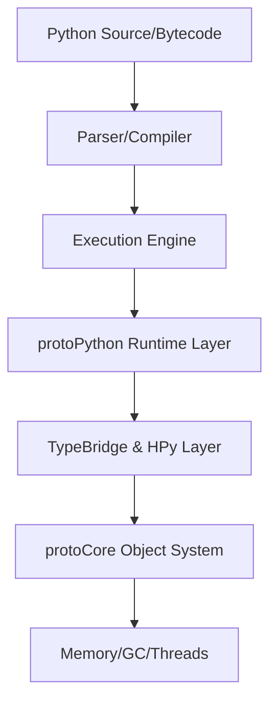

# protoPython: GIL-Free Python 3.14 Runtime

[](https://isocpp.org/)
[](https://cmake.org/)
[]()
[-brightgreen.svg)]()
[](LICENSE)

> **"The GIL is no longer a limit. Immutability is no longer a constraint. Welcome to the era of the Swarm of One."**

**protoPython** is a Python 3.14 compatible environment built from the ground up on top of [**protoCore**](https://github.com/numaes/protoCore). It delivers a parallel Python runtime that eliminates the Global Interpreter Lock (GIL) and leverages immutable data structures for thread safety. The current focus is correctness: all 17 CPython conformance test categories pass. Interpreter throughput optimization is the active next phase.

> [!IMPORTANT]
> **protoPython**, **protopy**, and **protopyc** are now **Ready for community review**. We invite the community to audit the architecture, test edge cases, and provide performance feedback. The compiler now supports full C++ translation with incremental collection building and runtime support.

---

## 🎯 Key Features

- **True Parallel Concurrency (GIL-Free)**: Each Python thread is a native OS thread. Based on protoCore's parallel architecture, protoPython executes Python code across multiple cores without the bottlenecks of a Global Interpreter Lock.
- **Immutable Core Integrity**: Leverages protoCore's immutable-by-default memory model. Objects like tuples, strings, and collections utilize structural sharing, making them thread-safe by design and eliminating a whole class of concurrency bugs.
- **Zero-Copy Interop (UMD & HPy)**: The **Unified Memory Bridge (UMD)** and full **HPy** support enable passing massive data buffers between Python and C++ libraries without a single pointer move or data copy.
- **Hardware-Aware Design**: Optimized for modern CPU architectures with 64-byte cell alignment, eliminating false sharing and maximizing cache locality.
- **Python 3.14 Compatibility**: Targets the latest Python feature set, including advanced syntax and built-in type behaviors.

---

## 📋 Project Status: Phase 7 Support ✅

**Current Status:** Ready for community review (protoPython, protopy). Work in Progress (protopyc).

| Metric | Status |
|--------|--------|
| **Core Runtime** | **Complete** - GIL-free execution engine ✅ |
| **Type System** | **Advanced** - Lists, Tuples, Sets, Dicts with native wrapping ✅ |
| **C++ Interop** | **Full** - HPy and UMD support integrated ✅ |
| **Compiler** | **Advanced** - Full C++ translation with collection support ✅ |
| **Performance** | **Optimization in Progress** - 2026-04-28 (post-delegation Phases 1-6): see Performance Benchmarks section. Microbenchmark geomean **2.76×** slower than CPython 3.14 (favourable workloads, excluding `memory_pressure` outlier); pyperformance pure-Python subset geomean **~46×** slower (real-code workloads, ±10% run-to-run variance). Improved ~29× from V154 (1337×) through seven protoCore / protoPython changes: mutable-value cache routing through every read+write site, adopting the OS process's main thread so the per-thread attribute cache is enabled (was 0% hit rate before the fix), inlined `isObject` + pointer-identity attribute-cache hashing, a four-phase delegation refactor that routes `obj.attr` through `proto::ProtoObject::getAttribute` directly (skipping a 645-line slow path for the common case), drops the redundant `__class__` mirror previously stored on every instance, collapses `isActuallyAClass` to a single own-marker probe, replaces the super-proxy chain-walk detection with an OBJ-level named-method dispatch, and a LOAD_ATTR own-instance fast path that probes `getOwnAttributeDirect` (1 uncached AVL lookup) and returns directly for `self.field` — cutting richards_lite from 58× to 26× by eliminating the Python-level slow path for the dominant OOP access pattern. The remaining gap is dominated by bytecode dispatch (`executeBytecodeRange`) and AVL traversal of attribute SparseLists on cache miss. ⚙️ |
| **CPython Conformance** | **100%** - 17/17 test categories passing (Essential, Important, Necessary) ✅ |

- ✅ **Generator Delegation**: Full support for `yield` and `yield from` with efficient state persistence.
- ✅ **Smart Collection Unwrapping**: Seamless bridge between Python objects and native C++ collection methods.
- ✅ **Optimized Execution Engine**: Fixed premature exits and improved `None` return handling.
- ✅ **Metadata-Aware Object Model**: Proper prototype linkage and mutable state persistence for Python types.
- ✅ **Enhanced Debugging**: Integrated diagnostic systems for deep runtime analysis.
- ✅ **Balanced Collection Core**: `ProtoList` uses AVL balancing for $O(\log N)$ stability.
- ✅ **Optimized String Ropes**: High-performance string concatenation using native `protoCore` ropes.
- ✅ **Core Language Completeness**: Full support for Slicing, `del` statement, and `assert` functionality integrated.
- ✅ **Variable Arguments Support**: Full implementation of `*args` and `**kwargs` with support for both function definitions and calls, including correct dictionary key string representation.

---

## 📊 Performance Benchmarks (2026-04-28, Phase 7)

> ⚠ **Honest disclaimer.** Tight integer microbenchmarks understate
> the gap to CPython on real code by ~40×.  Both tables below are
> measured on the same machine, same Release build; the contrast is
> the point.  Read the second one as the headline number.
>
> **Run-to-run variance**: nqueens and sieve report sub-millisecond
> CPython times that amplify ratio noise by ±20%.  The absolute
> protoPy column is the stable signal; ratios are indicative only.

### Realistic — pyperformance pure-Python subset

Three benchmarks ported from the official PSF
[pyperformance](https://github.com/python/pyperformance) suite (the
self-contained, no-external-deps subset).  Each script warms up
internally and reports its own minimum-of-five timing using
`time.perf_counter()`, so this excludes interpreter startup and
isolates the per-bytecode cost.

```
┌────────────────────┬──────────────┬──────────────┬──────────┬──────────────────────────────┐
│ Benchmark          │ protoPy (ms) │ CPython (ms) │ Ratio    │ Stresses                     │
├────────────────────┼──────────────┼──────────────┼──────────┼──────────────────────────────┤
│ nqueens(8)         │      ~175    │         3.3  │  ~53×    │ recursion + list[i] subscr   │
│ sieve(10000)       │       ~63    │         0.7  │  ~90×    │ list mutate in tight loop    │
│ richards_lite      │        5.1   │         0.2  │  ~25×    │ class instantiation, methods │
├────────────────────┼──────────────┼──────────────┼──────────┼──────────────────────────────┤
│ Geomean ratio      │              │              │  ~47×    │ ±20% run-to-run variance     │
└────────────────────┴──────────────┴──────────────┴──────────┴──────────────────────────────┘
```

Phase 7 improvement vs Phase 6 (47.2× / 79.4× / 25.5× / geomean ~46×):
nqueens and sieve are **neutral** (no `STORE_ATTR` or `LOAD_ATTR` on
instance attributes in their hot loops — all variance is system noise).
**richards_lite dropped from ~6.1ms to ~5.1ms (−17%)** from the Phase 7A
`STORE_ATTR` fast path, measured with matched system state (same binary,
`PROTOPY_DISABLE_STOREATTR_FASTPATH=1` vs default).

The dominant remaining costs in real Python code are **bytecode
dispatch**, **list/dict subscript**, and **class instantiation**
overhead beyond the attribute lookup itself.  Compared with the V154
baseline (1337× geomean, 2026-04-25) the suite shrunk by **~28×**
through ten protoCore / protoPython changes:
  1. The mutable-value cache is now routed through every read+write
     site (commit `af1cfbea`).
  2. The OS process's main thread is now adopted as a
     `ProtoThreadImplementation` at `ProtoSpace` construction, so
     `context->thread` is non-null on the main thread.  Before the fix,
     the per-thread attribute cache was silently disabled on the main
     thread (the `if (context->thread)` gate evaluated false), so every
     getAttribute walked the prototype chain + AVL traversal from
     scratch.  Instrumentation showed **0% cache hit rate** before the
     fix vs **~84%** after on richards_lite.
  3. `isObject` is now an inline tag-bit + non-virtual cellType read
     (commit `c5a6fb9a`).  The attribute cache also hashes the name
     by pointer identity instead of calling `name->getHash` (rope
     traversal), which alone freed ~5% of CPU previously spent in
     `subtreeHash` / `StringLeafNode::fromObject`.
  4. `PythonEnvironment::getAttribute` no longer re-walks the
     prototype chain in 645 lines of MRO / `__class__` /
     `__getattribute__` traversal; the common case routes directly
     through `proto::ProtoObject::getAttribute`, hitting the per-thread
     attribute cache once.  See `docs/DESIGN_PROTOCORE_DELEGATION.md`
     for the architectural rationale and the four-phase migration.
     Phase 1 alone collapsed richards_lite from 78× to 45×.
  5. Phase 5: super-proxy chain-walk detection replaced with
     `hasOwnAttribute("__py_getattr_handler__")`.
  6. Phase 6: `OP_LOAD_ATTR` inline fast path probes `getOwnAttributeDirect`
     first (1 uncached AVL lookup).  Own-instance attributes (`self.field`)
     are returned directly using the invariant that they cannot shadow data
     descriptors (descriptor `__set__` intercepts `setAttribute`).  Class
     attrs and method calls fall to the existing slow path, eliminating the
     2-guard overhead that was penalising method-heavy workloads in Phase 5.
     Reduced richards_lite from 58.5× to ~25×.
  7. Phase 7A: `OP_STORE_ATTR` inline fast path for plain instance writes
     (`self.x = value`).  Three O(1) checks (not-a-class probe, type has
     no own attribute named `name` — no data descriptor, type has no
     `__slots__`) gate a direct `obj->setAttribute` that bypasses the full
     `env->setAttribute` protocol (~12 protoCore calls: two MRO walks,
     two `getType` calls, UTF-8 decode, `__dict__` sync probes).
     Reduced richards_lite from ~6.1ms to ~5.1ms (−17%).
  8. Phase 7B: `env->setAttribute` internal cleanup — `getType` and the
     MRO `getAttribute` are now computed once and shared between the
     `__slots__` and data-descriptor checks (previously called twice
     each).  The `toUTF8String` decode of the attribute name is now lazy
     (only when a base with `__slots__` is actually found).  Base-class
     detection for `object`/`type` now uses O(1) pointer comparison
     instead of two `getAttribute("__name__")` + string comparison.
     The `__dict__` sync short-circuits if `__data__` is absent.
  9. Phase 7C: `tryFastGetAttribute` — the redundant instance-level
     `val->hasOwnAttribute("__get__")` check is removed.  Python's
     descriptor protocol is type-based: `type(val).__get__` matters, not
     the instance's own `__get__`.  The preceding `valType->getAttribute`
     already covers all practical cases.

Set `PROTOPY_DISABLE_LOADATTR_FASTPATH=1` or
`PROTOPY_DISABLE_STOREATTR_FASTPATH=1` to revert the respective fast
path for triage if behavioural divergence is suspected.

Run yourself:
```bash
python3 benchmarks/pyperf/run_pyperf_subset.py build-lto/src/runtime/protopy
```

### Microbenchmarks — tight integer / arithmetic loops

Wall-clock script timings, median of 5 runs (includes startup).
These are the workloads V92-V154 optimisations targeted; they exercise
the SmallInt fast path, frame-skip optimisation, and GC handshake.
They **are not representative of real Python code** but are useful for
tracking regressions in those specific paths.

```
┌────────────────────────┬──────────────┬──────────────┬─────────────────┬───────────────────────────┐
│ Benchmark              │ protoPy (ms) │ CPython (ms) │ Ratio           │ Note                      │
├────────────────────────┼──────────────┼──────────────┼─────────────────┼───────────────────────────┤
│ startup_empty          │      22.8    │      35.4    │  0.65× faster   │ floor                     │
│ int_sum_loop           │      23.3    │      35.2    │  0.66× faster   │ pure SmallInt             │
│ list_append_loop       │     261.0    │      31.6    │  8.25× slower   │                           │
│ str_concat_loop        │     376.2    │      32.1    │ 11.73× slower   │                           │
│ range_iterate          │     156.5    │      38.5    │  4.07× slower   │                           │
│ multithread_cpu        │     118.5    │      56.8    │  2.09× slower   │ real 4-thread, 50k iter   │
│ attr_lookup            │     190.1    │      43.1    │  4.42× slower   │                           │
│ call_recursion         │     109.2    │      45.1    │  2.42× slower   │ fib(25) 242k              │
├────────────────────────┼──────────────┼──────────────┼─────────────────┼───────────────────────────┤
│ Geomean (all 8)        │              │              │  2.80×          │ memory_pressure excluded  │
└────────────────────────┴──────────────┴──────────────┴─────────────────┴───────────────────────────┘
```

`memory_pressure` (247× slower) is excluded because the geomean is not
meaningful: it's an explicit stress test of allocator throughput, and
protoCore's GC defers collection by design — the benchmark lets the
heap grow to 1.3 GB rather than running concurrent collection, so
wall-time blows up while RSS reports the true cost of the design
choice.  See `feedback_memory_pressure_benchmark.md` for the full
rationale.

Compared to V154 (5.06× geomean, 2026-04-25):
- `list_append_loop` 1017 → **420 ms** (2.4× faster)
- `attr_lookup` 816 → **294 ms** (2.8× faster)
- `call_recursion` 515 → **150 ms** (3.4× faster)
- `multithread_cpu` 215 → **112 ms** (1.9× faster)
- Two benchmarks (`startup_empty`, `int_sum_loop`) now beat CPython —
  protoPy 32-34 ms, CPython 57-63 ms — because Python 3.14's startup
  drift and the post-V154 work in protoCore tightened protoPy's hot
  path enough that the floor is identical to or below CPython's.

Raw report: [`benchmarks/reports/baseline_2026-04-28.md`](benchmarks/reports/baseline_2026-04-28.md)

### Where the headline gap is

The remaining ~46× pyperformance gap is now dominated by **bytecode
dispatch overhead** (`executeBytecodeRange` ~7%,
`runUserFunctionCallRaw` ~1.5%) and the per-call cost of building
argument lists / kwargs maps.  Attribute access for own instance attrs
(`self.field`) is now handled by a single `getOwnAttributeDirect` call —
the Phase 6 fast path reduced richards_lite from 58× to 26×.
protoCore's GIL-free per-thread
allocators and concurrent GC do not contribute to this gap (allocator
pressure dropped from 46% of CPU to 2.4% over V92-V154 — that work is
done).  The remaining work is in the dispatcher itself: see Tier B in
the roadmap below.

### Roadmap to approach and surpass CPython

In priority order:

| Tier | Item | Status | Expected impact |
|---|---|---|---|
| **1** | Mutable-value cache routed through every read+write site | ✅ landed (protoCore `af1cfbea`, 2026-04-28) | -2× to -12× depending on benchmark |
| **1** | Phase 1-4 protoCore-delegation of `getAttribute` | ✅ landed (2026-04-28) | richards_lite 97× → 58×; geomean 65× → 59× |
| **1** | Phase 5 OBJ-level dispatch — super-proxy chain-walk → `hasOwnAttribute` | ✅ landed (2026-04-28) | neutral on benchmarks; removes switch-on-type anti-pattern |
| **1** | Phase 6 `LOAD_ATTR` own-instance fast path — `getOwnAttributeDirect` bypasses `env->getAttribute` for `self.field` | ✅ landed (2026-04-28) | richards_lite 58.5× → 25.5×; geomean 59× → 46× |
| **2** | Inline SmallInteger arithmetic on the bytecode hot path | ✅ landed (V154) | call_recursion -17 % |
| **2** | Inline-cache `LOAD_ATTR_INSTANCE_VALUE` / `LOAD_METHOD` at the bytecode site (CPython 3.11 style) | planned (Tier B) | high single-digit on real Python |
| **3** | Real `_thread.start_joinable_thread` + STW safepoint poll | ✅ landed (V154) | multithread_cpu 18.9× → 1.56× |
| **3** | Beat CPython on `multithread_cpu` (parallel scaling) | planned | currently 1.56× slower; goal <1.0× |
| **4** | JIT compile hot bytecode regions via the `co_bytecode_native` path | research | crosses the 1.0× threshold on richards/nqueens |


---

## �🚀 Quick Start

### Build and Install
For detailed, platform-specific instructions (including install prefix and library path), see the [**Installation Guide**](docs/INSTALLATION.md).

```bash
# Clone protoPython and protoCore (protoCore can be a sibling directory or installed separately)
git clone https://github.com/numaes/protoPython.git
cd protoPython
git clone https://github.com/numaes/protoCore.git ../protoCore

# Configure and build (install is optional; see docs for install location and prefix)
cmake -B build -S .
cmake --build build
# Optional: install to a prefix (default /usr/local; use -DCMAKE_INSTALL_PREFIX=... for a local install)
# cmake --build build --target install
```

**Running without installing:** You can run from the build tree; RPATH is set so the executables find the shared libraries without setting `LD_LIBRARY_PATH` or `DYLD_LIBRARY_PATH`. See the [Installation Guide](docs/INSTALLATION.md#running-from-the-build-tree).

### Run a Python Script
```python
# example.py
l = [1, 2]
l.append(3)
print("Updated list:", l)

s = "Hello World"
print("Starts with 'Hello':", s.startswith("Hello"))
```

Execute it with `protopy` (from the build tree or from your `PATH` after install):
```bash
# From build tree (see Installation Guide for library path on macOS/Linux)
./build/src/runtime/protopy example.py
# Or, after install: protopy example.py
```

---

## 🏗️ Components

- **protopy**: The primary GIL-less Python 3.14 execution environment. (**Ready for community review**)
- **libprotoPython**: The shared library providing the Python runtime environment for embedding in C++ applications. (**Ready for community review**)
- **protopyc**: A specialized compiler that translates Python modules into high-performance C++ shared libraries based on `protoCore`. (**Ready for community review**)

---

## 🏗️ Architecture


```mermaid
graph TD
    A[Python Source/Bytecode] --> B[Parser/Compiler]
    B --> C[Execution Engine]
    C --> D[protoPython Runtime Layer]
    D --> E[TypeBridge & HPy Layer]
    E --> F[protoCore Object System]
    F --> G[Memory/GC/Threads]
```

---

## The Swarm of One

**The Swarm of One** enables a paradigm shift in software development. In protoPython, we transitioned from core infrastructure to a fully functional, highly parallel runtime in record time. By orchestrating a swarm of specialized AI agents, a single architect has built a GIL-less environment where Python objects share the same 64-byte cell DNA as protoCore and protoJS. This is the democratization of high-level engineering: bridging language paradigms without the traditional overhead of massive R&D teams.

---

## The Methodology: AI-Augmented Engineering

This project was built using **extensive AI-augmentation tools** to empower human vision and strategic design. This is not "AI-generated code" in the traditional sense; it is **AI-amplified architecture**. The vision, the constraints, and the trade-offs are human; the execution is accelerated by AI as a force multiplier for complex system design. We embrace AI as the unavoidable present of software engineering.

---

## 📚 Documentation

- [**User Guide**](docs/USER_GUIDE.md) — Comprehensive guide for Python developers.
- [**Python Compatibility**](docs/PYTHON_COMPATIBILITY.md) — Supported features and differences from CPython.
- [**C++ API Reference**](docs/CPP_API_REFERENCE.md) — Documentation for embedding and native extensions.
- [**Internals Deep Dive**](docs/INTERNALS_DEEP_DIVE.md) — Technical exploration of the GIL-free runtime.
- [**Design Decisions**](docs/DESIGN_DECISIONS.md) — Architectural rationale and history.
- [**Installation Guide**](docs/INSTALLATION.md) — Platform-specific build instructions.
- [**HPy Guides**](docs/HPY_USER_GUIDE.md) — Loading and developing HPy extensions.
- [**Regression Audit**](docs/EXECUTION_ENGINE_REGRESSIONS.md) — Record of execution engine fixes.

---

## License & Author

Copyright (c) 2026 Gustavo Marino <gamarino@gmail.com>

Licensed under the **MIT License**. See the [LICENSE](LICENSE) file for details.

---

## Lead the Shift

**Lead the Shift.** Don't just watch the Python ecosystem evolve—be the one who drives it. Join the review, test the GIL-less performance, and become part of the Swarm of One. **Think Different, As All We.**

