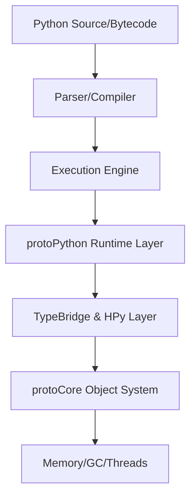

# protoPython: GIL-Free Python 3.14 Runtime

[](https://isocpp.org/)
[](https://cmake.org/)
[]()
[-brightgreen.svg)]()
[](LICENSE)

> **"The GIL is no longer a limit. Immutability is no longer a constraint. Welcome to the era of the Swarm of One."**

**protoPython** is a Python 3.14 compatible environment built from the ground up on top of [**protoCore**](https://github.com/numaes/protoCore). It delivers a parallel Python runtime that eliminates the Global Interpreter Lock (GIL) and leverages immutable data structures for thread safety. The current focus is correctness: all 17 CPython conformance test categories pass. Interpreter throughput optimization is the active next phase.

> [!IMPORTANT]
> **protoPython**, **protopy**, and **protopyc** are now **Ready for community review**. We invite the community to audit the architecture, test edge cases, and provide performance feedback. The compiler now supports full C++ translation with incremental collection building and runtime support.

---

## 🎯 Key Features

- **True Parallel Concurrency (GIL-Free)**: Each Python thread is a native OS thread. Based on protoCore's parallel architecture, protoPython executes Python code across multiple cores without the bottlenecks of a Global Interpreter Lock.
- **Immutable Core Integrity**: Leverages protoCore's immutable-by-default memory model. Objects like tuples, strings, and collections utilize structural sharing, making them thread-safe by design and eliminating a whole class of concurrency bugs.
- **Zero-Copy Interop (UMD & HPy)**: The **Unified Memory Bridge (UMD)** and full **HPy** support enable passing massive data buffers between Python and C++ libraries without a single pointer move or data copy.
- **Hardware-Aware Design**: Optimized for modern CPU architectures with 64-byte cell alignment, eliminating false sharing and maximizing cache locality.
- **Python 3.14 Compatibility**: Targets the latest Python feature set, including advanced syntax and built-in type behaviors.

---

## 📋 Project Status: Phase 7 Support ✅

**Current Status:** Ready for community review (protoPython, protopy). Work in Progress (protopyc).

| Metric | Status |
|--------|--------|
| **Core Runtime** | **Complete** - GIL-free execution engine ✅ |
| **Type System** | **Advanced** - Lists, Tuples, Sets, Dicts with native wrapping ✅ |
| **C++ Interop** | **Full** - HPy and UMD support integrated ✅ |
| **Compiler** | **Advanced** - Full C++ translation with collection support ✅ |
| **Performance** | **Optimization in Progress** - Correctness baseline (V92) established; throughput tuning is the active next phase ⚙️ |
| **CPython Conformance** | **100%** - 17/17 test categories passing (Essential, Important, Necessary) ✅ |

- ✅ **Generator Delegation**: Full support for `yield` and `yield from` with efficient state persistence.
- ✅ **Smart Collection Unwrapping**: Seamless bridge between Python objects and native C++ collection methods.
- ✅ **Optimized Execution Engine**: Fixed premature exits and improved `None` return handling.
- ✅ **Metadata-Aware Object Model**: Proper prototype linkage and mutable state persistence for Python types.
- ✅ **Enhanced Debugging**: Integrated diagnostic systems for deep runtime analysis.
- ✅ **Balanced Collection Core**: `ProtoList` uses AVL balancing for $O(\log N)$ stability.
- ✅ **Optimized String Ropes**: High-performance string concatenation using native `protoCore` ropes.
- ✅ **Core Language Completeness**: Full support for Slicing, `del` statement, and `assert` functionality integrated.
- ✅ **Variable Arguments Support**: Full implementation of `*args` and `**kwargs` with support for both function definitions and calls, including correct dictionary key string representation.

---

## 📊 Performance Benchmarks (V92 Baseline)

The table below is the **V92 correctness baseline** — the first measurement taken after all 17 CPython conformance test categories passed. Prior benchmark runs recorded startup-only times because the scripts were not executing to completion; these results reflect genuine end-to-end execution.

The architecture (GIL-free, lock-free primitives, immutable core) is correct and sound. Interpreter throughput — reducing per-opcode overhead, object-allocation cost, and GC pressure — is the active optimization focus starting from this baseline.

```
┌──────────────────────────────────────────────────────────────────────────────────────┐
│ Performance Audit: protoPython vs CPython 3.14   (V92 correctness baseline)          │
│ (median of 2 runs, timeouts excluded)                                                │
│ 2026-04-19 Linux x86_64                                                              │
├────────────────────────┬──────────────┬──────────────┬───────────────┬───────────────┤
│ Benchmark              │ Time P (ms)  │ Time C (ms)  │ Ratio         │ Peak RSS(P/C) │
├────────────────────────┼──────────────┼──────────────┼───────────────┼───────────────┤
│ startup_empty          │      39.24   │      32.44   │  1.2x slower  │ 23.1/ 10.2MB  │
│ int_sum_loop           │     841.80   │      31.35   │  26.9x slower │183.0/ 10.2MB  │
│ list_append_loop       │     957.59   │      32.08   │  29.9x slower │184.4/ 10.5MB  │
│ str_concat_loop        │     786.21   │      31.48   │  25.0x slower │153.7/ 10.2MB  │
│ range_iterate          │    2191.19   │      42.04   │  52.1x slower │286.7/ 10.2MB  │
│ multithread_cpu        │    3403.53   │      35.62   │  95.6x slower │505.7/ 10.4MB  │
│ attr_lookup            │    3198.93   │      50.17   │  63.8x slower │221.6/ 10.2MB  │
│ call_recursion         │   38870.44   │      43.80   │ 887.4x slower │236.1/ 10.2MB  │
│ memory_pressure        │   48947.88   │      57.50   │ 851.3x slower │  2.4/  0.0GB  │
├────────────────────────┼──────────────┼──────────────┼───────────────┼───────────────┤
│ Geomean Ratio          │              │              │  56.4x slower │               │
└──────────────────────────────────────────────────────────────────────────────────────┘
```
> [!NOTE]
> *Time P* is protoPython wall time. *Time C* is CPython 3.14 wall time. These numbers establish the correctness baseline; throughput optimization is underway.

> [!TIP]
> Known bottlenecks driving the overhead: (1) per-opcode immutable-copy overhead from the copy-on-write object model, (2) GC pressure from temporary object creation per operation, (3) lack of inline caches for attribute lookup and function dispatch. These are architectural optimization targets, not design flaws.

---

## �🚀 Quick Start

### Build and Install
For detailed, platform-specific instructions (including install prefix and library path), see the [**Installation Guide**](docs/INSTALLATION.md).

```bash
# Clone protoPython and protoCore (protoCore can be a sibling directory or installed separately)
git clone https://github.com/numaes/protoPython.git
cd protoPython
git clone https://github.com/numaes/protoCore.git ../protoCore

# Configure and build (install is optional; see docs for install location and prefix)
cmake -B build -S .
cmake --build build
# Optional: install to a prefix (default /usr/local; use -DCMAKE_INSTALL_PREFIX=... for a local install)
# cmake --build build --target install
```

**Running without installing:** You can run from the build tree; RPATH is set so the executables find the shared libraries without setting `LD_LIBRARY_PATH` or `DYLD_LIBRARY_PATH`. See the [Installation Guide](docs/INSTALLATION.md#running-from-the-build-tree).

### Run a Python Script
```python
# example.py
l = [1, 2]
l.append(3)
print("Updated list:", l)

s = "Hello World"
print("Starts with 'Hello':", s.startswith("Hello"))
```

Execute it with `protopy` (from the build tree or from your `PATH` after install):
```bash
# From build tree (see Installation Guide for library path on macOS/Linux)
./build/src/runtime/protopy example.py
# Or, after install: protopy example.py
```

---

## 🏗️ Components

- **protopy**: The primary GIL-less Python 3.14 execution environment. (**Ready for community review**)
- **libprotoPython**: The shared library providing the Python runtime environment for embedding in C++ applications. (**Ready for community review**)
- **protopyc**: A specialized compiler that translates Python modules into high-performance C++ shared libraries based on `protoCore`. (**Ready for community review**)

---

## 🏗️ Architecture


```mermaid
graph TD
    A[Python Source/Bytecode] --> B[Parser/Compiler]
    B --> C[Execution Engine]
    C --> D[protoPython Runtime Layer]
    D --> E[TypeBridge & HPy Layer]
    E --> F[protoCore Object System]
    F --> G[Memory/GC/Threads]
```

---

## The Swarm of One

**The Swarm of One** enables a paradigm shift in software development. In protoPython, we transitioned from core infrastructure to a fully functional, highly parallel runtime in record time. By orchestrating a swarm of specialized AI agents, a single architect has built a GIL-less environment where Python objects share the same 64-byte cell DNA as protoCore and protoJS. This is the democratization of high-level engineering: bridging language paradigms without the traditional overhead of massive R&D teams.

---

## The Methodology: AI-Augmented Engineering

This project was built using **extensive AI-augmentation tools** to empower human vision and strategic design. This is not "AI-generated code" in the traditional sense; it is **AI-amplified architecture**. The vision, the constraints, and the trade-offs are human; the execution is accelerated by AI as a force multiplier for complex system design. We embrace AI as the unavoidable present of software engineering.

---

## 📚 Documentation

- [**User Guide**](docs/USER_GUIDE.md) — Comprehensive guide for Python developers.
- [**Python Compatibility**](docs/PYTHON_COMPATIBILITY.md) — Supported features and differences from CPython.
- [**C++ API Reference**](docs/CPP_API_REFERENCE.md) — Documentation for embedding and native extensions.
- [**Internals Deep Dive**](docs/INTERNALS_DEEP_DIVE.md) — Technical exploration of the GIL-free runtime.
- [**Design Decisions**](docs/DESIGN_DECISIONS.md) — Architectural rationale and history.
- [**Installation Guide**](docs/INSTALLATION.md) — Platform-specific build instructions.
- [**HPy Guides**](docs/HPY_USER_GUIDE.md) — Loading and developing HPy extensions.
- [**Regression Audit**](docs/EXECUTION_ENGINE_REGRESSIONS.md) — Record of execution engine fixes.

---

## License & Author

Copyright (c) 2026 Gustavo Marino <gamarino@gmail.com>

Licensed under the **MIT License**. See the [LICENSE](LICENSE) file for details.

---

## Lead the Shift

**Lead the Shift.** Don't just watch the Python ecosystem evolve—be the one who drives it. Join the review, test the GIL-less performance, and become part of the Swarm of One. **Think Different, As All We.**

