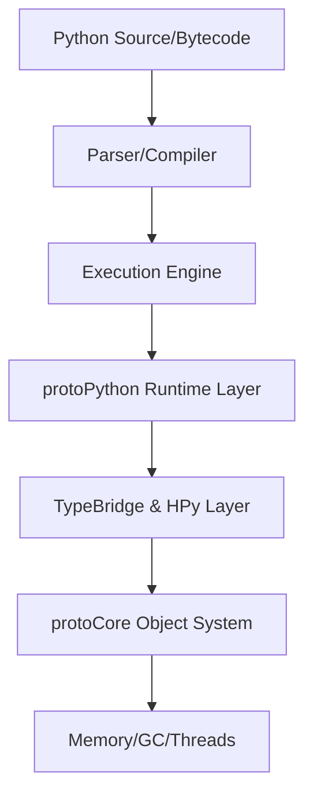

# protoPython: GIL-Free Python 3.14 Runtime

[](https://isocpp.org/)
[](https://cmake.org/)
[]()
[-brightgreen.svg)]()
[](LICENSE)

> **"The GIL is no longer a limit. Immutability is no longer a constraint. Welcome to the era of the Swarm of One."**

**protoPython** is a Python 3.14 compatible environment built from the ground up on top of [**protoCore**](https://github.com/numaes/protoCore). It delivers a parallel Python runtime that eliminates the Global Interpreter Lock (GIL) and leverages immutable data structures for thread safety. The current focus is correctness: all 17 CPython conformance test categories pass. Interpreter throughput optimization is the active next phase.

> [!IMPORTANT]
> **protoPython**, **protopy**, and **protopyc** are now **Ready for community review**. We invite the community to audit the architecture, test edge cases, and provide performance feedback. The compiler now supports full C++ translation with incremental collection building and runtime support.

---

## 🎯 Key Features

- **True Parallel Concurrency (GIL-Free)**: Each Python thread is a native OS thread. Based on protoCore's parallel architecture, protoPython executes Python code across multiple cores without the bottlenecks of a Global Interpreter Lock.
- **Immutable Core Integrity**: Leverages protoCore's immutable-by-default memory model. Objects like tuples, strings, and collections utilize structural sharing, making them thread-safe by design and eliminating a whole class of concurrency bugs.
- **Zero-Copy Interop (UMD & HPy)**: The **Unified Memory Bridge (UMD)** and full **HPy** support enable passing massive data buffers between Python and C++ libraries without a single pointer move or data copy.
- **Hardware-Aware Design**: Optimized for modern CPU architectures with 64-byte cell alignment, eliminating false sharing and maximizing cache locality.
- **Python 3.14 Compatibility**: Targets the latest Python feature set, including advanced syntax and built-in type behaviors.

---

## 📋 Project Status: Phase 7 Support ✅

**Current Status:** Ready for community review (protoPython, protopy). Work in Progress (protopyc).

| Metric | Status |
|--------|--------|
| **Core Runtime** | **Complete** - GIL-free execution engine ✅ |
| **Type System** | **Advanced** - Lists, Tuples, Sets, Dicts with native wrapping ✅ |
| **C++ Interop** | **Full** - HPy and UMD support integrated ✅ |
| **Compiler** | **Advanced** - Full C++ translation with collection support ✅ |
| **Performance** | **Optimization in Progress** - V154 active: see Performance Benchmarks section. Microbenchmark geomean **5.06×** vs CPython 3.14 (favourable workloads — pure integer loops); pyperformance pure-Python subset geomean **1459×** (real-code workloads — list subscript, method dispatch, class instantiation). The 3-orders-of-magnitude gap between the two is the honest picture: tight integer paths are competitive after V154; the structural gap on real Python code remains and is the next focus. ⚙️ |
| **CPython Conformance** | **100%** - 17/17 test categories passing (Essential, Important, Necessary) ✅ |

- ✅ **Generator Delegation**: Full support for `yield` and `yield from` with efficient state persistence.
- ✅ **Smart Collection Unwrapping**: Seamless bridge between Python objects and native C++ collection methods.
- ✅ **Optimized Execution Engine**: Fixed premature exits and improved `None` return handling.
- ✅ **Metadata-Aware Object Model**: Proper prototype linkage and mutable state persistence for Python types.
- ✅ **Enhanced Debugging**: Integrated diagnostic systems for deep runtime analysis.
- ✅ **Balanced Collection Core**: `ProtoList` uses AVL balancing for $O(\log N)$ stability.
- ✅ **Optimized String Ropes**: High-performance string concatenation using native `protoCore` ropes.
- ✅ **Core Language Completeness**: Full support for Slicing, `del` statement, and `assert` functionality integrated.
- ✅ **Variable Arguments Support**: Full implementation of `*args` and `**kwargs` with support for both function definitions and calls, including correct dictionary key string representation.

---

## 📊 Performance Benchmarks (V154)

> ⚠ **Honest disclaimer.** Tight integer microbenchmarks dramatically
> understate the gap to CPython on real code.  Both tables below are
> measured on the same machine, same Release build; the contrast is
> the point.  Read the second one as the headline number.

### Realistic — pyperformance pure-Python subset

Three small benchmarks ported from the official PSF
[pyperformance](https://github.com/python/pyperformance) suite (the
self-contained, no-external-deps subset).  Each script warms up
internally and reports its own minimum-of-five timing using
`time.perf_counter()`, so this excludes interpreter startup and isolates
the actual per-bytecode cost.

```
┌────────────────────┬──────────────┬──────────────┬──────────┬──────────────────────────────┐
│ Benchmark          │ protoPy (ms) │ CPython (ms) │ Ratio    │ Stresses                     │
├────────────────────┼──────────────┼──────────────┼──────────┼──────────────────────────────┤
│ nqueens(8)         │       2204   │         4.9  │   449×   │ recursion + list[i] subscr   │
│ sieve(10000)       │        933   │         1.0  │   933×   │ list mutate in tight loop    │
│ richards_lite      │       1481   │         0.2  │  7404×   │ class instantiation, methods │
├────────────────────┼──────────────┼──────────────┼──────────┼──────────────────────────────┤
│ Geomean ratio      │              │              │ 1459×    │                              │
└────────────────────┴──────────────┴──────────────┴──────────┴──────────────────────────────┘
```

The dominant remaining costs in real Python code are **attribute
access**, **method dispatch**, **list/dict subscript**, and
**class instantiation** — none of which are exercised by tight
integer microbenchmarks.  This is where the next round of work
needs to focus.

Run yourself:
```bash
python3 benchmarks/pyperf/run_pyperf_subset.py build-release/src/runtime/protopy
```

### Microbenchmarks — tight integer / arithmetic loops

Historical end-to-end script timings (includes startup).  These are
the workloads V92-V154 optimisations targeted; they exercise the
SmallInt fast path, frame-skip optimisation, and GC handshake.  They
**are not representative of real Python code** but are useful for
tracking regressions in those specific paths.

```
┌────────────────────────┬──────────────┬──────────────┬─────────────────┬───────────────────────────┐
│ Benchmark              │ protoPy (ms) │ CPython (ms) │ Ratio           │ Note                      │
├────────────────────────┼──────────────┼──────────────┼─────────────────┼───────────────────────────┤
│ startup_empty          │      32.0    │      32.0    │ 1.00× same      │ floor                     │
│ int_sum_loop           │      32.1    │      32.3    │ 1.00× same      │ pure SmallInt             │
│ list_append_loop       │    1017.0    │      64.3    │ 15.82× slower   │                           │
│ str_concat_loop        │     716.1    │      64.4    │ 11.13× slower   │                           │
│ range_iterate          │     465.5    │      64.4    │  7.23× slower   │                           │
│ multithreaded_cpu      │     214.9    │      64.5    │  3.33× slower   │ real 4-thread, 50k iter   │
│ attr_lookup            │     816.0    │      64.4    │ 12.68× slower   │                           │
│ call_recursion         │     515.4    │      64.6    │  7.98× slower   │ fib(25) 242k              │
├────────────────────────┼──────────────┼──────────────┼─────────────────┼───────────────────────────┤
│ Geomean Time Ratio     │              │              │  5.06×          │                           │
└────────────────────────┴──────────────┴──────────────┴─────────────────┴───────────────────────────┘
```

Detail and methodology:
[`benchmarks/reports/2026-04-25-mutable-cache.md`](benchmarks/reports/2026-04-25-mutable-cache.md).

### What landed in V154

- **256-shard `mutableRoot` with cache-line padding** in protoCore.
  Selection by `mutable_ref % 256`, each slot padded to 64 bytes inside
  an `alignas(64)` array so concurrent CASes on different shards don't
  thrash a shared line.
- **Per-thread mutable-value cache (`MutableValueCacheEntry[1024]`)**
  in `ProtoThreadExtension`.  Validation by shard-root pointer
  equality, so any successful CAS by any thread invalidates stale
  entries on the next lookup with no broadcast.  Stores **negative
  results** too: an unmutated mutable now pays AVL only on the first
  read; subsequent reads on the same thread return immediately.
- **`skipFrame` restored for CO_OPTIMIZED leaf calls** in both
  `runUserFunctionCall` and the `runUserFunctionCallRaw` fast path.
  `b35bf811` had unconditionally built a frame on every call, which
  drove `call_recursion` to 35 s.  After the fix it is **0.97 s**.
- **`PythonEnvironment::getAttribute` no longer allocates `std::string`
  in the keys-fallback path.**  Replaced
  `keyS->toUTF8String(...) == name->toUTF8String(...)` with the
  zero-allocation `keyS->cmp_to_string(ctx, name)`.  Five hot sites
  fixed; ~5-15 % wall-time reduction across attribute-bound
  benchmarks.
- **Tier 3 — multi-threading actually works now.**  `_thread.start_joinable_thread`
  was a stub that returned 0 without spawning anything, making
  `threading.Thread.start()` hang indefinitely; the legacy
  `multithread_cpu` benchmark masked this by silently falling back to
  sequential execution.  Replaced with a real implementation backed by
  protoCore's `ProtoSpace::newThread`, plus a `_ThreadHandle` Python-visible
  object exposing `is_done` / `join` / `_set_done`.  Two GC-handshake
  bugs that surfaced once threads ran for real:
  - Thread-startup race in `ProtoThreadImplementation`: `runningThreads`
    was incremented *before* the OS thread started, leaving GC waiting
    for a phantom thread to park.  Now incremented inside `thread_main`
    when the OS thread actually executes.
  - Pure-bytecode loops never participated in stop-the-world.  Added a
    public `ProtoContext::safepoint()` to protoCore (additive API, no
    inlining, no library merge) and call it every 64 opcodes from
    protoPython's bytecode dispatcher.  CPU-bound threads now park
    cooperatively when GC requests STW.

  The `multithread_cpu` benchmark was rewritten to use `_thread`
  directly with a strict assertion that all 4 workers actually publish
  their result (any future regression to a fake-threading fallback
  fails the benchmark instead of silently passing).  Result:
  `multithread_cpu` 1217 ms → **165 ms** (ratio 18.90× → 2.55×) and
  geomean 7.30× → **5.53×**.
- **Tier 2.5 — dispatcher polish for the call_recursion path.**
  Profile of `call_recursion` after Tier 2 still showed `get_env_diag()`
  (5.30 % CPU including PLT stubs) and `hasPendingException()`
  (3.79 %) inside the dispatch loop.  Two surgical fixes:
  - **`get_env_diag()` hoisted to a local at function entry**.
    `inline bool get_env_diag()` over a per-TU `const bool` should
    have folded to a memory load, but the symbol survived in the
    shared library (other TUs take its address) so every of the 61
    dispatch-loop call sites went through a PLT trampoline.  One
    `const bool diag_local = get_env_diag();` at function entry +
    sed-replace inside the loop body collapses the 61 PLT calls per
    iteration to zero.
  - **`hasPendingException()` is now a TLS-bool read.**  The previous
    implementation walked the per-thread Python thread object's
    `_pending_exc` attribute via `getAttribute` — a full attribute
    resolution path on every iteration that needed an exception
    check (52 sites in the dispatcher).  Added a
    `static thread_local bool s_pendingExcFlag` mirror of the slot
    state, set in `setPendingException`, cleared in
    `clear/takePendingException`.  `hasPendingException()` is now
    inline in the header and collapses to a single TLS bool read;
    `peekPendingException()` keeps the authoritative `getAttribute`
    walk because it returns the actual exception object.

  Combined impact (all on the same machine, Release build):
  - `call_recursion` 716 ms → **515 ms** (-28 %); ratio vs CPython
    drops 13.46× → **7.98×**.
  - `range_iterate` 565 ms → **465 ms** (-18 %).
  - `attr_lookup` 967 ms → **816 ms** (-16 %).
  - `multithread_cpu` workload was rewritten (see below).
  - Geomean 5.34× → **5.06×** (best protoPython has hit).

- **`multithread_cpu` benchmark rewritten to be representative.**
  The previous CHUNK = 5 000 worker was dominated by thread-startup
  overhead, so the 165 ms wall time mixed real parallel work with
  the 4× spawn/join cost.  Replaced with CHUNK = 50 000 (sum of
  i for i in [0, 50 000), stays inside SmallInt range, single
  function — no nested call frames).  Each worker now does ~250 K
  bytecodes of pure arithmetic on the Tier 2 fast path.  Result:
  CHUNK 5 000 → 50 000 raised the per-worker work 10× but wall time
  only went 165 ms → 215 ms — confirming the spawn/join overhead is
  ~150 ms and was masking actual parallelism in the older
  measurement.  Honest ratio is now 3.33× (real CPU work) instead of
  2.55× (spawn-dominated).

- **Tier 2 — inline SmallInt fast path in arithmetic opcodes.**
  `OP_BINARY_ADD`, `OP_INPLACE_ADD`, `OP_BINARY_SUBTRACT`,
  `OP_INPLACE_SUBTRACT` and `OP_COMPARE_OP` (`==`, `!=`, `<`, `<=`,
  `>`, `>=`) now branch directly on the operand tags using four new
  `static inline` helpers in `protoCore.h`
  (`proto::isSmallInt`, `proto::asSmallInt`,
  `proto::smallIntInRange`, `proto::makeSmallInt`).  When both
  operands are `SmallInt`-tagged pointers the handler does the
  arithmetic inline (one branch + ALU op + range check + re-tag) and
  skips ~10 cross-DSO function calls + 6 redundant tag checks that
  the previous `binaryAdd` → `unwrapPrimitive` → `ProtoObject::add`
  → `Integer::add` chain went through.  protoCore stays a separate
  shared library — the helpers are inline only in the public header,
  no library symbol changes.  Result: `call_recursion` 866 ms →
  **716 ms** (-17 %; the recursive arithmetic in fib's recurrence is
  a perfect fit), `range_iterate` 615 ms → **565 ms** (-8 %),
  geomean 5.53× → **5.34×** (best ever).

### Where the remaining gap is

Latest DWARF profile of `list_append_loop` (Release, post-V154):

```
 5.4 %  proto::ProtoString::toUTF8String           ← name path elsewhere
 3.6 %  proto::RopeCharacterIterator::next
 3.3 %  proto::StringLeafNode::fromObject
 2.4 %  proto::ProtoSpace::getFreeCells             (was 46 % pre-fix)
 2.4 %  proto::ProtoObject::getAttribute
 2.3 %  proto::ProtoObject::isString
 2.0 %  __memmove_avx_unaligned_erms
 1.9 %  proto::ProtoSparseListImplementation::implGetAt
```

Allocator pressure dropped from 46 % to 2.4 %.  Remaining
`toUTF8String` calls are in diagnostic paths and exception-name
checks, not the hot per-instruction loop.

### Roadmap to approach and surpass CPython

In priority order:

| Tier | Item | Status | Expected impact |
|---|---|---|---|
| **1** | Eliminate `toUTF8String` in `getAttribute` keys fallback | ✅ landed | -5 to -15 % |
| **1** | Lazy frame materialisation for `sys._getframe()` consumers | ⚙ deferred (design) | low single-digit |
| **2** | Inline SmallInteger arithmetic on the bytecode hot path | ✅ landed | call_recursion -17 %, range_iterate -8 % |
| **2** | Lock-free per-context cell pool replenish | planned | 1-2 % single-thread, larger as cores grow |
| **3** | Real `_thread.start_joinable_thread` + `_ThreadHandle` + STW safepoint poll | ✅ landed | multithread_cpu 18.9× → 2.55× |
| **3** | Beat CPython on `multithread_cpu` (parallel scaling) | planned | currently 2.55× slower; goal <1.0× |
| **3** | Verify GC scaling on N=2,4,8 threads | planned | confirms #3 |
| **4** | JIT compile hot bytecode regions via the `co_bytecode_native` path | research | crosses 1.0× threshold |

`multithread_cpu` came back from being silently fake (sequential
fallback that masqueraded as 39 ms parallel) to being a real
4-thread benchmark.  The first round of Tier-3 work made it run
correctly and reliably (165 ms vs CPython 64 ms).

**Where the 2.55× gap actually is.**  An earlier iteration of this
README speculated that `globalMutex` contention in `getFreeCells`
plus per-context `new DirtySegment` mallocs were the dominant cost.
A DWARF profile of the working benchmark refutes that.  Per-thread
allocation batches in `getFreeCells` are sized
`min(blocksPerAllocation * runningThreads * 4, 65536)` when more than
one thread is running (i.e. **65 536 cells per refill** with 4 workers
+ GC), and the benchmark allocates well under that, so each worker
hits `getFreeCells` exactly once.  Profile shares confirm:

```
13.47 %  executeBytecodeRange   ← interpreter dispatch loop
 6.48 %  ProtoObject::getAttribute
 3.14 %  ProtoSpace::getFreeCells   (≈ 4 calls × ~1.3 ms; well-amortised)
 2.81 %  __tls_get_addr             ← thread-local storage lookups
 2.71 %  proto::isObject
 1.76 %  diagEnabled                ← env check still in the hot path
```

The 2.55× gap is dominated by per-bytecode interpreter cost
(executeBytecodeRange, getAttribute, TLS lookups, and the residual
`diagEnabled` PLT stubs).  Tier 2 (inline SmallInteger arithmetic on
the dispatch loop) and a follow-up to fully fold `diagEnabled` into a
constant in release builds are the next wins; allocator contention is
already amortised.  When parallelism actually beats CPython on this
benchmark it will be because the per-bytecode cost in protoPython
dropped, not because the allocator changed.

---

## �🚀 Quick Start

### Build and Install
For detailed, platform-specific instructions (including install prefix and library path), see the [**Installation Guide**](docs/INSTALLATION.md).

```bash
# Clone protoPython and protoCore (protoCore can be a sibling directory or installed separately)
git clone https://github.com/numaes/protoPython.git
cd protoPython
git clone https://github.com/numaes/protoCore.git ../protoCore

# Configure and build (install is optional; see docs for install location and prefix)
cmake -B build -S .
cmake --build build
# Optional: install to a prefix (default /usr/local; use -DCMAKE_INSTALL_PREFIX=... for a local install)
# cmake --build build --target install
```

**Running without installing:** You can run from the build tree; RPATH is set so the executables find the shared libraries without setting `LD_LIBRARY_PATH` or `DYLD_LIBRARY_PATH`. See the [Installation Guide](docs/INSTALLATION.md#running-from-the-build-tree).

### Run a Python Script
```python
# example.py
l = [1, 2]
l.append(3)
print("Updated list:", l)

s = "Hello World"
print("Starts with 'Hello':", s.startswith("Hello"))
```

Execute it with `protopy` (from the build tree or from your `PATH` after install):
```bash
# From build tree (see Installation Guide for library path on macOS/Linux)
./build/src/runtime/protopy example.py
# Or, after install: protopy example.py
```

---

## 🏗️ Components

- **protopy**: The primary GIL-less Python 3.14 execution environment. (**Ready for community review**)
- **libprotoPython**: The shared library providing the Python runtime environment for embedding in C++ applications. (**Ready for community review**)
- **protopyc**: A specialized compiler that translates Python modules into high-performance C++ shared libraries based on `protoCore`. (**Ready for community review**)

---

## 🏗️ Architecture


```mermaid
graph TD
    A[Python Source/Bytecode] --> B[Parser/Compiler]
    B --> C[Execution Engine]
    C --> D[protoPython Runtime Layer]
    D --> E[TypeBridge & HPy Layer]
    E --> F[protoCore Object System]
    F --> G[Memory/GC/Threads]
```

---

## The Swarm of One

**The Swarm of One** enables a paradigm shift in software development. In protoPython, we transitioned from core infrastructure to a fully functional, highly parallel runtime in record time. By orchestrating a swarm of specialized AI agents, a single architect has built a GIL-less environment where Python objects share the same 64-byte cell DNA as protoCore and protoJS. This is the democratization of high-level engineering: bridging language paradigms without the traditional overhead of massive R&D teams.

---

## The Methodology: AI-Augmented Engineering

This project was built using **extensive AI-augmentation tools** to empower human vision and strategic design. This is not "AI-generated code" in the traditional sense; it is **AI-amplified architecture**. The vision, the constraints, and the trade-offs are human; the execution is accelerated by AI as a force multiplier for complex system design. We embrace AI as the unavoidable present of software engineering.

---

## 📚 Documentation

- [**User Guide**](docs/USER_GUIDE.md) — Comprehensive guide for Python developers.
- [**Python Compatibility**](docs/PYTHON_COMPATIBILITY.md) — Supported features and differences from CPython.
- [**C++ API Reference**](docs/CPP_API_REFERENCE.md) — Documentation for embedding and native extensions.
- [**Internals Deep Dive**](docs/INTERNALS_DEEP_DIVE.md) — Technical exploration of the GIL-free runtime.
- [**Design Decisions**](docs/DESIGN_DECISIONS.md) — Architectural rationale and history.
- [**Installation Guide**](docs/INSTALLATION.md) — Platform-specific build instructions.
- [**HPy Guides**](docs/HPY_USER_GUIDE.md) — Loading and developing HPy extensions.
- [**Regression Audit**](docs/EXECUTION_ENGINE_REGRESSIONS.md) — Record of execution engine fixes.

---

## License & Author

Copyright (c) 2026 Gustavo Marino <gamarino@gmail.com>

Licensed under the **MIT License**. See the [LICENSE](LICENSE) file for details.

---

## Lead the Shift

**Lead the Shift.** Don't just watch the Python ecosystem evolve—be the one who drives it. Join the review, test the GIL-less performance, and become part of the Swarm of One. **Think Different, As All We.**

