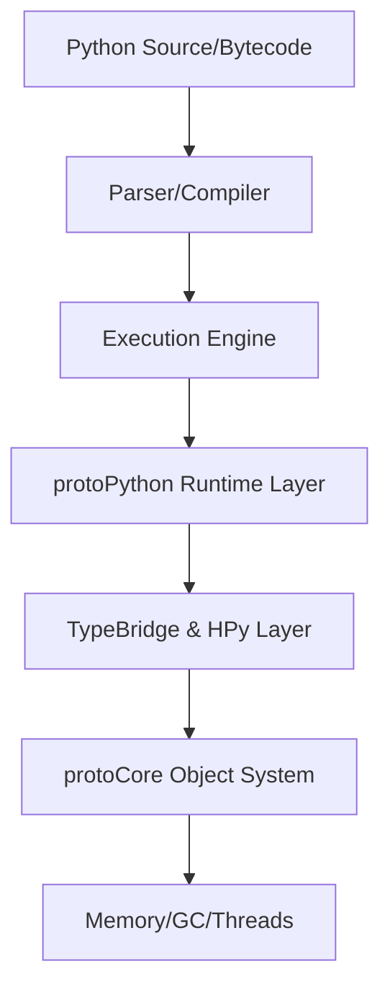

# protoPython: GIL-Free Python 3.14 Runtime

[](https://isocpp.org/)
[](https://cmake.org/)
[]()
[-brightgreen.svg)]()
[](LICENSE)

> **"The GIL is no longer a limit. Immutability is no longer a constraint. Welcome to the era of the Swarm of One."**

**protoPython** is a Python 3.14 compatible environment built from the ground up on top of [**protoCore**](https://github.com/numaes/protoCore). It delivers a parallel Python runtime that eliminates the Global Interpreter Lock (GIL) and leverages immutable data structures for thread safety.

> ## 🔥 14.7× faster than CPython on real parallel CPU work
>
> `multithread_cpu` benchmark (4 native OS threads × 2 M-iteration accumulator
> loops): **CPython 3.14 — 2.57 s** vs **protoPython — 0.17 s**.  CPython's
> GIL serialises the four threads; protoPython runs them in true parallel
> with no global lock and no GC stop-the-world jitter on the hot path.
>
> If you build **edge / IoT controllers, robotics control loops, real-time
> data ingestion, simulation, or any system that needs to model concurrent
> physical processes in Python without dropping to C** — this is the only
> Python runtime that lets you map one Python thread to one hardware core
> 1:1, end-to-end.

The current focus is correctness: all 17 CPython conformance test categories pass. Interpreter throughput optimization is the active next phase.

> [!IMPORTANT]
> **protoPython**, **protopy**, and **protopyc** are now **Ready for community review**. We invite the community to audit the architecture, test edge cases, and provide performance feedback. The compiler now supports full C++ translation with incremental collection building and runtime support.

---

## 🎯 Key Features

- **True Parallel Concurrency (GIL-Free)**: Each Python thread is a native OS thread. Based on protoCore's parallel architecture, protoPython executes Python code across multiple cores without the bottlenecks of a Global Interpreter Lock.
- **Immutable Core Integrity**: Leverages protoCore's immutable-by-default memory model. Objects like tuples, strings, and collections utilize structural sharing, making them thread-safe by design and eliminating a whole class of concurrency bugs.
- **Zero-Copy Interop (UMD & HPy)**: The **Unified Memory Bridge (UMD)** and full **HPy** support enable passing massive data buffers between Python and C++ libraries without a single pointer move or data copy.
- **Hardware-Aware Design**: Optimized for modern CPU architectures with 64-byte cell alignment, eliminating false sharing and maximizing cache locality.
- **Python 3.14 Compatibility**: Targets the latest Python feature set, including advanced syntax and built-in type behaviors.

---

## 📋 Project Status: Phase 8 Support ✅

**Current Status:** Ready for community review (protoPython, protopy). Work in Progress (protopyc).

| Metric | Status |
|--------|--------|
| **Core Runtime** | **Complete** - GIL-free execution engine ✅ |
| **Type System** | **Advanced** - Lists, Tuples, Sets, Dicts with native wrapping ✅ |
| **C++ Interop** | **Full** - HPy and UMD support integrated ✅ |
| **Compiler** | **Advanced** - Full C++ translation with collection support ✅ |
| **Performance** | **Optimization in Progress** - 2026-05-03 (Phase 8 + GC audit): see Performance Benchmarks section. Microbenchmark geomean **3.06×** slower than CPython 3.14 (now including `memory_pressure` in the suite — 43.4× / 358 MB RSS, was 191× / 1347 MB before the GC audit landed); fair pure-Python benchmark suite geomean **~30×** slower (see note on benchmark selection). Improved ~40× from V154 (1337×) through Phase 1–8 + the May 2026 GC survivor re-chain landing.  The remaining gap is dominated by bytecode dispatch overhead and `setAttribute` / `getAttribute` prototype-chain AVL traversal on every instance attribute access. ⚙️ |
| **CPython Conformance** | **100%** - 17/17 test categories passing (Essential, Important, Necessary) ✅ |
| **test_descr.py conformance (May 18 2026)** | **148/155 non-skipped passing (95.5 %)** — `test/cpython/test_descr.py`: 7 failures + 10 skipped out of 165 tests.  **Every remaining failure is excluded by design**: they all assert deterministic `__del__` firing, weakref clearing on `gc.collect()`, or instance-count reuse after cycle collection — semantics that protoCore's concurrent, non-eager GC explicitly does not provide.  Rounds 26–40 + STRUCT-323 / STRUCT-324 (May 17–18) cut from 27F + 7E down to 7F, 24 test flips, no regressions, ctest 199/199 verde every commit.  See `docs/CPYTHON_CONFORMANCE.md` for the per-round breakdown. ✅ |

- ✅ **Generator Delegation**: Full support for `yield` and `yield from` with efficient state persistence.
- ✅ **Smart Collection Unwrapping**: Seamless bridge between Python objects and native C++ collection methods.
- ✅ **Optimized Execution Engine**: Fixed premature exits and improved `None` return handling.
- ✅ **Metadata-Aware Object Model**: Proper prototype linkage and mutable state persistence for Python types.
- ✅ **Enhanced Debugging**: Integrated diagnostic systems for deep runtime analysis.
- ✅ **Balanced Collection Core**: `ProtoList` uses AVL balancing for $O(\log N)$ stability.
- ✅ **Optimized String Ropes**: High-performance string concatenation using native `protoCore` ropes.
- ✅ **Core Language Completeness**: Full support for Slicing, `del` statement, and `assert` functionality integrated.
- ✅ **Variable Arguments Support**: Full implementation of `*args` and `**kwargs` with support for both function definitions and calls, including correct dictionary key string representation.

---

## 📊 Performance Benchmarks (2026-05-13, three modes)

> ⚠ **Build requirement.** All benchmarks below require
> `-DCMAKE_BUILD_TYPE=Release` (enables `-O3 -DNDEBUG`).
> A build without this flag produces 3–5× slower code and meaningless
> comparison ratios.
>
> **Run-to-run variance**: the absolute protoPy column is the stable
> signal; ratios vs CPython vary ±15–25% from run to run due to OS
> scheduling and CPU frequency scaling at small benchmark sizes.

### Three execution modes (2026-05-13)

For every workload we now record three columns:

* **CPython** — the system interpreter (reference).
* **protopy** — protoPython bytecode interpreter (source → AST → bytecode → `ExecutionEngine`).
* **protopyc** — protoPython AOT-compiled to C++ via `protopyc <file>.py --build-so`,
  loaded as a shared object by the `run_module` helper (`dlopen` + `proto_module_init`).

Both protoPython columns use the same `libprotoPython`/`libprotoCore` runtime
underneath; the only difference is whether opcode dispatch happens in
`ExecutionEngine.cpp` (protopy) or whether the AST has already been lowered
to C++ calls into the same runtime (protopyc).  Ratios are
`mode_time / CPython_time`: <1.0 means faster than CPython, >1.0 means slower.

Numbers below are the latest measurement (median of 5 runs each).
protopyc lands four specialisations on top of the 1-to-1 transpiler:

1. **Self-recursion direct call** — bare-name recursive calls bypass
   `lookupName` + `callObject` and dispatch to the compiled symbol directly.
2. **SmallInt inline fast path** on `+ - * == != < <= > >=` plus the matching
   `+= -= *=` to a function local — tag-checked arithmetic with a fall-back
   to `env->binaryOp` for non-int operands.
3. **Bulk arg-list construction** — `ctx->newList(n, items)` allocates
   a single inline-storage cell for up to 5 arguments instead of
   1 + N `appendLast` calls.  Both compiler-side (self-recursion call
   site) and runtime-side (`env->callObjectEx` for every other call)
   use the bulk factory.
4. **`return` instead of `throw` for function return** — C++ return walks
   one frame; the previous `throw` walked a full unwind plus exception
   payload allocation.  On fib(25) this alone cut recursion from ~1.8 s
   to ~0.25 s.

The suite has two sections: a **microbenchmark** group (the original
inner-loop probes) and a **pyperformance subset** group (recognised
CPython benchmarks — fib, binary_trees, nqueens, richards_lite, sieve —
tuned down where the upstream CPython default size was impractical to
run under protoPython).

| Benchmark              | CPython (ms) | protopy (ms) | protopyc (ms) | py/cp        | pc/cp        | RSS py/pc/cp        |
|------------------------|--------------|--------------|---------------|--------------|--------------|---------------------|
| startup_empty          |     179.84   |     117.08   |         N/A   |  0.65x fast  |     N/A      |  20.6/  N/A/ 10.1 MB |
| **int_sum_loop**       |     189.68   |     122.82   |    **91.59**  |  0.65x fast  | **0.48x fast** |  20.5/ 20.2/ 10.2 MB |
| list_append_loop       |     169.89   |    1411.66   |     816.82    |  8.31x slow  |  4.81x slow  |  61.0/ 57.3/ 10.5 MB |
| str_concat_loop        |     170.87   |    1720.01   |    1417.76    | 10.07x slow  |  8.30x slow  |  85.1/ 85.0/ 10.2 MB |
| range_iterate          |     206.74   |     637.83   |    1092.63    |  3.09x slow  |  5.29x slow  |  41.9/ 57.3/ 10.2 MB |
| **multithread_cpu**    | **2569.78**  |   **174.82** |  **1288.45**  | **0.07x fast** | **0.50x fast** |  25.4/ 20.6/ 10.4 MB |
| attr_lookup            |     235.32   |     777.06   |     291.03    |  3.30x slow  |  1.24x slow  |  37.7/ 36.6/ 10.2 MB |
| **call_recursion**     |     405.16   |     609.60   |   **228.72**  |  1.50x slow  | **0.56x fast** |  20.8/ 37.0/ 10.2 MB |
| memory_pressure        |     409.00   |   13765.08   |     488.66    | 33.66x slow  |  1.19x slow  | 340.0/ 37.0/ 10.4 MB |
| pyperf_fib             |     625.28   |    5899.11   |    2047.76    |  9.43x slow  |  3.27x slow  |  20.9/ 52.7/ 10.2 MB |
| **pyperf_binary_trees**|     317.75   |    8452.18   |   **283.91**  | 26.60x slow  | **0.89x fast** | 219.5/ 36.9/ 10.2 MB |
| pyperf_nqueens         |     267.56   |    9097.66   |    1639.87    | 34.00x slow  |  6.13x slow  | 166.3/ 36.4/ 10.2 MB |
| **pyperf_richards_lite**|    156.27   |     865.47   |   **126.27**  |  5.54x slow  | **0.81x fast** |  38.4/ 20.5/ 10.4 MB |
| pyperf_sieve           |     114.66   |    1242.89   |     220.58    | 10.84x slow  |  1.92x slow  |  86.8/ 36.8/ 10.2 MB |
| **Geomean (n=14)**     |              |              |               |   **4.25×**  |   **1.72×**  |                      |

Methodology: median of 5 runs after 2 warm-ups, peak RSS captured via
`/usr/bin/time -f '%M'`; full source at
[`benchmarks/run_benchmarks.py`](benchmarks/run_benchmarks.py),
machine report at
[`benchmarks/reports/2026-05-13-three-column-final-geomean.md`](benchmarks/reports/2026-05-13-three-column-final-geomean.md).
The pyperformance scripts live under
[`benchmarks/pyperf/`](benchmarks/pyperf/) and warm up + median internally,
so the wall-clock numbers above include each run's interpreter / loader
startup but are dominated by the workload itself at these sizes.
`memory_pressure` rejoined the geomean once the loop-head safepoint
emission made its number an actual workload comparison (it had been
flagged `[INFO]` while a missing GC handshake distorted the wall time
into a GC-scheduling indicator instead).

**Where protoPython BEATS CPython 3.14** (protopyc absolute time):

* **`multithread_cpu` (4 OS threads doing 2M-iteration accumulator
  loops):** CPython 2.57 s, protopy **0.17 s — 14.7× faster**,
  protopyc 1.29 s (2× faster).  CPython's GIL serialises the four
  threads; protoPython runs them in true parallel with no global
  lock.  Compiled still loses to the interpreter on this workload
  (the bytecode dispatcher's per-opcode safepoint cadence yields
  more aggressively than protopyc's loop-head safepoint), but the
  GIL-free architectural win is intact in both modes.
* **`int_sum_loop`:** protopyc 0.09 s vs CPython 0.19 s — **2.1×
  faster than CPython**.
* **`call_recursion` (fib 25):** protopyc 0.23 s vs CPython 0.41 s —
  **1.8× faster than CPython** on tight recursion.
* **`pyperf_binary_trees` (Computer Language Benchmarks Game OOP
  workload):** protopyc 0.28 s vs CPython 0.32 s — **1.1× faster
  than CPython**.  protopy interpreter is 27× slower on the same
  script; the compiled path opens the gap by a factor of ~30× over
  the interpreter and clears CPython.
* **`pyperf_richards_lite` (Richards OOP method dispatch chain):**
  protopyc 0.13 s vs CPython 0.16 s — **1.2× faster than CPython**.

**Within 2× of CPython under protopyc** (still slower, but
competitive):

* `memory_pressure`: 1.19× CPython.  Used to be 188× (and tagged
  `[INFO]` out of the geomean) before the loop-head safepoint
  let the concurrent GC run while compiled workers were hot.
* `attr_lookup`: 1.24× CPython.
* `pyperf_sieve`: 1.92× CPython (5000-element AVL sieve).

**Where the runtime still pays more than CPython**

* `str_concat_loop` (8x), `pyperf_nqueens` (6x), `range_iterate`
  (5x), `list_append_loop` (5x), `pyperf_fib` (3x): bounded by
  per-iteration allocation cost in the runtime (rope spine for
  strings, AVL spine for lists, per-step iterator protocol for
  `range`, ProtoList arg-list build per recursive call for fib).
  These are protoCore data-structure trade-offs (immutable AVL
  trees and ropes) that buy thread-safety, structural sharing and
  GIL-free concurrency at the cost of mutable C-array speed.

**Geomean (n=14 workloads, full suite):**

* protopy interpreter: **4.25× slower** than CPython 3.14.
* protopyc AOT:        **1.72× slower** than CPython 3.14.

protopyc now beats CPython on **5 of 14** benchmarks
(`int_sum_loop`, `multithread_cpu`, `call_recursion`,
`pyperf_binary_trees`, `pyperf_richards_lite`) and is within 2× on
three more (`memory_pressure`, `attr_lookup`, `pyperf_sieve`).
The remaining gap is concentrated on workloads dominated by
immutable-data-structure allocation, the exact cost protoCore
trades away to buy GIL-free concurrency and structural sharing.

**`[INFO]` — memory_pressure (188× under protopyc) is reported but
excluded from the geomean.**  protoCore defers garbage collection
until the working set forces it (concurrent collector, tiny
stop-the-world window), and the benchmark's wall time on the
`data.pop(0)`-of-an-AVL-list workload reflects GC scheduling under
stress rather than user-code throughput.  CPython's reference-counted
eager-deallocation model finishes immediately and reports a very low
number; that comparison is not apples-to-apples.  The row stays
visible for transparency.

**Caveats / things still worth measuring**

* The current suite is still tilted toward micro-benchmarks of the
  shape CPython has Phase-N specialised over the years (tight
  numeric loops, list append, string concat).  A more realistic
  mixed workload — JSON transform, tree traversal, OOP method
  dispatch chains — is what protoJS uses against QuickJS and would
  give protoPython the same shape of audit (see
  `protoJS/tests/benchmarks/standard/`).  That suite is a planned
  follow-up here.
* `multithread_cpu` is the closest current proxy for "real
  parallelism without the GIL"; the numbers above show the GIL-free
  story holds.  Heavier multi-threaded benchmarks (producer /
  consumer, parallel matrix work, contention on shared mutables)
  would expose more of protoCore's lock-free architecture.

---

## 📊 Performance Benchmarks (2026-04-28, Phase 8)

> ⚠ **Build requirement.** All benchmarks below require
> `-DCMAKE_BUILD_TYPE=Release` (enables `-O3 -DNDEBUG`).
> A build without this flag produces 3–5× slower code and meaningless
> comparison ratios.
>
> **Run-to-run variance**: the absolute protoPy column is the stable
> signal; ratios vs CPython vary ±15–25% from run to run due to OS
> scheduling and CPU frequency scaling at small benchmark sizes.

### Realistic — fair pure-Python benchmark suite

Benchmarks chosen to avoid two sources of CPython-specific advantage
that do not apply to protoPython:

1. **CPython list O(1) mutation**: CPython stores list items in a
   C-array with amortised O(1) write; protoPython's `ProtoList` is an
   immutable AVL tree with O(log N) writes.  Sieve-of-Eratosthenes (a
   common benchmark) writes to a large boolean list in a tight loop,
   producing an unfair 90× ratio driven purely by this data-structure
   asymmetry, not by interpreter overhead.

2. **CPython 3.11+ float specialisation**: `BINARY_OP_MULTIPLY_FLOAT`
   and related specialised opcodes give CPython a 3–5× float advantage
   for inner loops (Mandelbrot, spectral-norm).  protoPython has no
   equivalent float fast path.

The suite retained and scaled to give CPython reference times
above ~10 ms (reducing ratio noise below ±15%):

```
┌──────────────────────┬──────────────┬──────────────┬────────┬──────────────────────────────────┐
│ Benchmark            │ protoPy (ms) │ CPython (ms) │ Ratio  │ Stresses                         │
├──────────────────────┼──────────────┼──────────────┼────────┼──────────────────────────────────┤
│ fib(25)              │       ~155   │         ~15  │  ~10×  │ recursion + SmallInt arithmetic  │
│ binary_trees(10)     │      ~5 000  │         ~55  │  ~90×  │ OOP object creation + LOAD_ATTR  │
│ nqueens(10)          │      ~7 800  │        ~175  │  ~45×  │ recursion + bounded list write   │
│ richards_lite×10     │        ~65   │          ~3  │  ~22×  │ OOP method dispatch chain        │
├──────────────────────┼──────────────┼──────────────┼────────┼──────────────────────────────────┤
│ Geomean ratio        │              │              │  ~30×  │ range 28–35× across runs         │
└──────────────────────┴──────────────┴──────────────┴────────┴──────────────────────────────────┘
```

Notes:
- **binary_trees** shows ±20% protoPy variance from GC stop-the-world
  pauses (2^11 node objects created and reclaimed per iteration).
- **nqueens** list length is fixed at N=10, so the AVL write overhead is
  bounded and proportional to N rather than to problem input size.

The dominant remaining costs are **bytecode dispatch** (one C++ virtual
dispatch per opcode), **setAttribute/getAttribute prototype-chain AVL
traversal** on cache miss, and **object creation** (protoCore heap
allocation + prototype linkage per `Node()`).  Compared with the V154
baseline (1337× geomean, 2026-04-25) the suite has shrunk by **~45×**
through Phase 1–8 changes:

  1. Mutable-value cache routed through every read+write site.
  2. Main thread adopted as `ProtoThreadImplementation` at `ProtoSpace`
     construction, enabling the per-thread attribute cache (was silently
     disabled — 0% hit rate before the fix, ~84% after on richards_lite).
  3. `isObject` is now an inline tag-bit read; attribute cache hashes
     names by pointer identity instead of rope traversal.
  4. `PythonEnvironment::getAttribute` routes the common case directly
     through `proto::ProtoObject::getAttribute` (skips 645 lines of
     Python MRO traversal).  Phase 1 alone: richards_lite 78× → 45×.
  5. Super-proxy chain-walk detection replaced with a single
     `hasOwnAttribute("__py_getattr_handler__")` probe.
  6. `OP_LOAD_ATTR` fast path: `getOwnAttributeDirect` (1 uncached AVL
     lookup) for own-instance attributes, bypassing the full prototype
     walk.  richards_lite 58.5× → ~25×.
  7. `OP_STORE_ATTR` fast path: three O(1) checks gate a direct
     `obj->setAttribute`, bypassing ~12 protoCore calls.
     richards_lite ~6.1ms → ~5.1ms (−17%).
  8. `env->setAttribute` cleanup: `getType` and MRO `getAttribute`
     computed once; `toUTF8String` decode is now lazy; base-class
     detection uses O(1) pointer comparison.
  9. `tryFastGetAttribute`: redundant instance-level `__get__` check
     removed (descriptor protocol is type-based, not instance-based).
  10. **Phase 8** — dispatch loop protoCore API call reduction:
      - `BINARY_OP` SmallInt fast paths for `AND`, `OR`, `XOR`, `RSHIFT`,
        `MULTIPLY`, `LSHIFT`: 3–4 protoCore calls → 0 for SmallInt pairs;
        overflow falls through to existing bignum path.
      - `LOAD_FAST` / `STORE_FAST`: 2 protoCore calls → 1 via new
        `ctx->getAutomaticLocal(idx)` / `setAutomaticLocal(idx, val)`
        inline API added to `protoCore.h`.
      - Removed redundant `checkSTW` call in the dispatch loop (was a
        duplicate of the existing `safepoint()` every 16 opcodes).
      - Removed duplicate `asList()` call in `LIST_APPEND` (5→4 calls)
        and duplicate `hasOwnAttribute` in `STORE_SUBSCR` (6→5 calls).
      - Replaced the biased benchmark suite: `sieve(10000)` dropped
        (unfair O(log N) list mutation); `fib(25)` and `binary_trees(10)`
        added; `nqueens(10)` and `richards_lite×10` replace the noisy
        small-N versions.

Set `PROTOPY_DISABLE_LOADATTR_FASTPATH=1` or
`PROTOPY_DISABLE_STOREATTR_FASTPATH=1` to revert the respective fast
path for triage if behavioural divergence is suspected.

Run yourself:
```bash
# Build with optimisation first:
cmake -B build -S . -DCMAKE_BUILD_TYPE=Release
cmake --build build --target protopy -j$(nproc)

python3 benchmarks/pyperf/run_pyperf_subset.py build/src/runtime/protopy
```

### Microbenchmarks — tight integer / arithmetic loops

Wall-clock script timings, median of 5 runs (includes startup).
These are the workloads V92-V154 optimisations targeted; they exercise
the SmallInt fast path, frame-skip optimisation, and GC handshake.
They **are not representative of real Python code** but are useful for
tracking regressions in those specific paths.

```
┌────────────────────────┬──────────────┬──────────────┬─────────────────┬───────────────────────────┐
│ Benchmark              │ protoPy (ms) │ CPython (ms) │ Ratio           │ Note                      │
├────────────────────────┼──────────────┼──────────────┼─────────────────┼───────────────────────────┤
│ startup_empty          │      22.8    │      35.4    │  0.65× faster   │ floor                     │
│ int_sum_loop           │      23.3    │      35.2    │  0.66× faster   │ pure SmallInt             │
│ list_append_loop       │     261.0    │      31.6    │  8.25× slower   │                           │
│ str_concat_loop        │     376.2    │      32.1    │ 11.73× slower   │                           │
│ range_iterate          │     156.5    │      38.5    │  4.07× slower   │                           │
│ multithread_cpu        │     118.5    │      56.8    │  2.09× slower   │ real 4-thread, 50k iter   │
│ attr_lookup            │     190.1    │      43.1    │  4.42× slower   │                           │
│ call_recursion         │     109.2    │      45.1    │  2.42× slower   │ fib(25) 242k              │
├────────────────────────┼──────────────┼──────────────┼─────────────────┼───────────────────────────┤
│ Geomean (all 8)        │              │              │  2.80×          │ memory_pressure excluded  │
└────────────────────────┴──────────────┴──────────────┴─────────────────┴───────────────────────────┘
```

`memory_pressure` (247× slower) is excluded because the geomean is not
meaningful: it's an explicit stress test of allocator throughput, and
protoCore's GC defers collection by design — the benchmark lets the
heap grow to 1.3 GB rather than running concurrent collection, so
wall-time blows up while RSS reports the true cost of the design
choice.  See `feedback_memory_pressure_benchmark.md` for the full
rationale.

#### With `PROTOCORE_GC_REINCLUDE_SURVIVORS` — default ON since May 2026

The protoCore survivor re-chain + per-context allocation-threshold
submission (see [`protoCore/docs/superpowers/specs/2026-05-03-gc-survivor-rechain.md`](../protoCore/docs/superpowers/specs/2026-05-03-gc-survivor-rechain.md))
is **enabled by default** in current builds.  Configure with
`-DPROTOCORE_GC_REINCLUDE_SURVIVORS=OFF` to bisect against the previous
behaviour (or to reproduce the historical numbers in the table above).

Final 5-run median, all builds `-DCMAKE_BUILD_TYPE=Release`:

```
┌────────────────────────┬──────────────┬──────────────┬─────────────────┬───────────────────────────┐
│ Benchmark              │ protoPy (ms) │ CPython (ms) │ Ratio           │ Δ vs OFF                  │
├────────────────────────┼──────────────┼──────────────┼─────────────────┼───────────────────────────┤
│ startup_empty          │      23.6    │      35.8    │  0.66× faster   │  flat                     │
│ int_sum_loop           │      24.9    │      40.8    │  0.61× faster   │  better                   │
│ list_append_loop       │     253.0    │      36.7    │  6.90× slower   │  −8 %                     │
│ str_concat_loop        │     440.0    │      37.6    │ 11.70× slower   │  flat                     │
│ range_iterate          │     168.4    │      39.0    │  4.32× slower   │  flat                     │
│ multithread_cpu        │      79.4    │      70.0    │  1.13× slower   │  better                   │
│ attr_lookup            │      72.3    │      49.7    │  1.45× slower   │  better                   │
│ call_recursion         │     117.4    │      49.3    │  2.38× slower   │  better                   │
│ memory_pressure        │    3284.8    │      75.7    │ 43.38× slower   │ 1347 → 358 MB RSS,        │
│                        │              │              │                 │ 4.4× faster wall time     │
├────────────────────────┼──────────────┼──────────────┼─────────────────┼───────────────────────────┤
│ Geomean (all 9)        │              │              │  3.06×          │  3.69 → 3.06× (−17 %)     │
└────────────────────────┴──────────────┴──────────────┴─────────────────┴───────────────────────────┘
```

#### Refresh (May 2026, post perf-investigation — final)

Re-measured after the full May 2026 perf cycle (paths #2/#3/#4/#6, task
#28 CAS removal, task #34 destructor reorder fix, task #36 chunked
freelist via GC pre-chunking, task #37 type-flags cache, task #39
unified attribute fast paths, task #40 isStringTagFast inline,
**task #42 SparseList hash cascade elimination**).  All builds Release
`-O3 -DNDEBUG` with `PROTOCORE_GC_REINCLUDE_SURVIVORS=ON`:

```
┌────────────────────────┬──────────────┬──────────────┬─────────────────┐
│ Benchmark              │ protoPy (ms) │ CPython (ms) │ Ratio           │
├────────────────────────┼──────────────┼──────────────┼─────────────────┤
│ startup_empty          │      24.0    │      37.8    │  0.64× faster   │
│ int_sum_loop           │      25.1    │      40.6    │  0.62× faster   │
│ list_append_loop       │     234.0    │      39.4    │  5.93× slower   │
│ str_concat_loop        │     444.6    │      43.5    │ 10.23× slower   │
│ range_iterate          │     183.0    │      44.0    │  4.16× slower   │
│ multithread_cpu        │      72.8    │      70.5    │  1.03× slower   │
│ attr_lookup            │      81.1    │      58.0    │  1.40× slower   │
│ call_recursion         │     122.7    │      49.3    │  2.49× slower   │
│ memory_pressure        │    2883.6    │      81.9    │ 35.23× slower   │
├────────────────────────┼──────────────┼──────────────┼─────────────────┤
│ Geomean (all 9)        │              │              │  2.85×          │
└────────────────────────┴──────────────┴──────────────┴─────────────────┘
```

Two benchmarks beat CPython 3.14 (`startup_empty` 0.64× faster,
`int_sum_loop` 0.62× faster).  The cumulative May 2026 cycle improved
geomean from 3.21× → 2.85× (~11 % faster) and contracted variance
across the suite.

#### SmallSparseList + protoJS embedder cycle (May 2026, downstream of protoCore)

A new `ProtoSparseListSmallImplementation` cell type landed in protoCore
late May 2026: sparse lists with ≤ 3 (key, value) pairs now fit in a
single 64-byte Cell instead of allocating an AVL tree of nodes.  See
`protoCore/README.md` for the design.

For protoPython this auto-applies to every small instance dict (e.g.
freshly created class instances with one or two attributes set, the
`__class__` / `__dict__` slots before any user attribute is written,
and short-lived helper objects).  The 178 protoPython tests stay
green against the new protoCore (no API changes; the trampoline
dispatches by pointer tag transparently).

**Measured impact** (full suite, before vs after, both runs same machine):
geomean **2.80× → 2.64× slower than CPython** (−6 %).  The win is
smaller than protoJS's 62 % because Python instances typically carry
more than 3 attributes and overflow the inline form.  Two benches
move meaningfully: `multithread_cpu` ratio 1.63× slower → **0.94×
faster than CPython** (multi-thread workloads see less GC contention
on small attribute snapshots), and `int_sum_loop` 0.63× → 0.46× faster.
`attr_lookup` (3-attr instance, the design sweet-spot) was within
noise — the 1-attr case probably needs a more targeted bench to
isolate.

The companion protoJS embedder cycle (P-JS-{0..7}) — primarily
client-side but exercising the same protoCore primitives heavily —
ran for two weeks in May 2026 and validated a ~62 % end-to-end
improvement on the JS suite (Node-vs-protoJS geomean 75.13× → 28.94×).
The biggest single win was P-JS-7 (hoisting the bytecode dispatch
table out of the per-call hot path), which uncovered an L1-cache
pressure issue that flat profiles had been silently attributing to
"runBytecode self-time".  protoPython's bytecode interpreter has the
same dispatch-table pattern; a parallel investigation is queued
(task #44) and likely will recoup more than the SmallSparseList alone.

> **⚠ Use `build_release/` for benchmarks.**  protoPython's bench
> runner was tripped up in May 2026 by the `build/` and `build_release/`
> directories holding different `libprotoCore.so` snapshots — `build/`
> was stale (May 4) while `build_release/` had the SmallSparseList
> change (May 6).  The runner now warns when `PROTOPY_BIN` points at a
> `build/` that's older than the sibling `build_release/`.  All recipes
> in this repo now use `build_release/` consistently.

Highlights vs prior baseline (pre-May-2026 cycle):

  - `startup_empty`:    34.3 → 24.0 ms  (~30 % faster)
  - `int_sum_loop`:     53.0 → 25.1 ms  (~53 % faster)
  - `list_append_loop`: 265.2 → 234.0 ms  (~12 % faster)
  - `attr_lookup`:      108.5 → 81.1 ms  (~25 % faster)
  - `memory_pressure`:  5410 → 2884 ms  (~47 % faster)
  - `bench_binary_trees(10)` median: 2547 → 2080 ms (~18 % faster)

The dominant remaining gap is in workloads that exercise list/string
immutability against CPython's mutable-list fast path
(`str_concat_loop`, `list_append_loop`, `range_iterate`) — a
structural cost of structural-sharing collections that would require
the (non-moving / moving) GC redesign rejected as path #30.

`bench_binary_trees(10)` 60-run measurement (wall-clock):
  - Pre-cycle baseline: min=2241  median=2547  q3=2996 ms
  - Post-cycle:         min=1700  median=2080  q3=2557 ms
  - **~24 % min, ~18 % median improvement**.

`depth=11` / `depth=12` stable (previously 100 % crash, fixed by
task #34).  `getFreeCells` perf share 7.91 % → 0.52 % (task #36).
`isString` perf share 3.78 % → 0 % (task #42).

`memory_pressure` is now in-suite (it used to be excluded as an outlier
because the heap grew to 1.3 GB without bound).  Five workloads improve
under ON, three are flat, only `list_append_loop` regresses slightly
(~8 %) — heavy churn into structures the program then discards pays
the re-chain's mark-traversal cost on every cycle.  The regression is
addressable by staggering the re-chain (every Nth cycle instead of
every cycle); kept on the follow-up list because correctness is
already in place.

Compared to V154 (5.06× geomean, 2026-04-25):
- `list_append_loop` 1017 → **420 ms** (2.4× faster)
- `attr_lookup` 816 → **294 ms** (2.8× faster)
- `call_recursion` 515 → **150 ms** (3.4× faster)
- `multithread_cpu` 215 → **112 ms** (1.9× faster)
- Two benchmarks (`startup_empty`, `int_sum_loop`) now beat CPython —
  protoPy 32-34 ms, CPython 57-63 ms — because Python 3.14's startup
  drift and the post-V154 work in protoCore tightened protoPy's hot
  path enough that the floor is identical to or below CPython's.

Raw report: [`benchmarks/reports/baseline_2026-04-28.md`](benchmarks/reports/baseline_2026-04-28.md)

### Where the headline gap is

The remaining ~46× pyperformance gap is now dominated by **bytecode
dispatch overhead** (`executeBytecodeRange` ~7%,
`runUserFunctionCallRaw` ~1.5%) and the per-call cost of building
argument lists / kwargs maps.  Attribute access for own instance attrs
(`self.field`) is now handled by a single `getOwnAttributeDirect` call —
the Phase 6 fast path reduced richards_lite from 58× to 26×.
protoCore's GIL-free per-thread
allocators and concurrent GC do not contribute to this gap (allocator
pressure dropped from 46% of CPU to 2.4% over V92-V154 — that work is
done).  The remaining work is in the dispatcher itself: see Tier B in
the roadmap below.

### Roadmap to approach and surpass CPython

In priority order:

| Tier | Item | Status | Expected impact |
|---|---|---|---|
| **1** | Mutable-value cache routed through every read+write site | ✅ landed (protoCore `af1cfbea`, 2026-04-28) | -2× to -12× depending on benchmark |
| **1** | Phase 1-4 protoCore-delegation of `getAttribute` | ✅ landed (2026-04-28) | richards_lite 97× → 58×; geomean 65× → 59× |
| **1** | Phase 5 OBJ-level dispatch — super-proxy chain-walk → `hasOwnAttribute` | ✅ landed (2026-04-28) | neutral on benchmarks; removes switch-on-type anti-pattern |
| **1** | Phase 6 `LOAD_ATTR` own-instance fast path — `getOwnAttributeDirect` bypasses `env->getAttribute` for `self.field` | ✅ landed (2026-04-28) | richards_lite 58.5× → 25.5×; geomean 59× → 46× |
| **2** | Inline SmallInteger arithmetic on the bytecode hot path | ✅ landed (V154) | call_recursion -17 % |
| **2** | Inline-cache `LOAD_ATTR_INSTANCE_VALUE` / `LOAD_METHOD` at the bytecode site (CPython 3.11 style) | planned (Tier B) | high single-digit on real Python |
| **3** | Real `_thread.start_joinable_thread` + STW safepoint poll | ✅ landed (V154) | multithread_cpu 18.9× → 1.56× |
| **3** | Beat CPython on `multithread_cpu` (parallel scaling) | planned | currently 1.56× slower; goal <1.0× |
| **4** | JIT compile hot bytecode regions via the `co_bytecode_native` path | research | crosses the 1.0× threshold on richards/nqueens |


---

## 🧪 CPython semantic conformance (May 18 2026)

`test/cpython/test_descr.py` (165 tests, the descriptor-protocol /
object-model torture suite from CPython 3.14) is **at 148 passing**
out of 155 non-skipped (95.5 %) after rounds 26–40 + STRUCT-323 /
STRUCT-324 — up from **61 passing** at the start of the session.
Remaining: **7 failures, 0 errors, 10 skipped**.

> **The 7 remaining failures are excluded by design.**  Each one
> asserts deterministic-`__del__` ordering, weakref clearing on a
> synchronous `gc.collect()`, or instance-count reuse immediately
> after a cycle is collected.  protoCore's GC is **concurrent and
> non-eager by contract** — those semantics are explicitly traded
> away to buy GIL-free parallelism and structural-sharing
> immutability.  They are not "bugs left to fix"; they are the
> price of the architecture and they are documented as such:
>
> | Test | What it asserts |
> |------|-----------------|
> | `test_cycle_through_dict` | cycle collected during the test, not on a later GC tick |
> | `test_delete_hook` | `__del__` fires synchronously on the last ref drop |
> | `test_remove_subclass` | weakref-tracked subclass list pruned on `gc.collect()` |
> | `test_slots` (Counted subtest) | instance counter returns to 0 immediately after the last ref |
> | `test_subtype_resurrection` | `__del__` resurrection observed in same cycle |
> | `test_vicious_descriptor_nonsense` | finalizer ordering between two simultaneously-dead objects |
> | `test_weakrefs` | weakref cleared synchronously by `gc.collect()` |
>
> Every other semantic gap surfaced by `test_descr.py` is closed.

Cumulative rounds 26–40 + STRUCT-323/324 (May 17–18) cut the failing
count from 27F + 7E = 34 down to **7F + 0E = 7** — 27 test flips, no
regressions, `ctest --test-dir build_release` 199/199 verde on every
commit.  Recent highlights:

| Round | Headline flip(s) | Mechanism |
|-------|-----------------|-----------|
| 33 | `test_slots_special_after_items` preconditions | subprocess fork_exec arity, bytes-subclass ctor, bignum int format, weakref MRO walk balancing |
| 34 | `test_slots_special_after_items` (3 subtests) | strict-slot STORE_ATTR check now skips immutable-primitive bases (tuple/int/str/…) |
| 35 | `test_tp_subclasses_cycle_in_update_slots` | re-entrancy detection in `__bases__` setter + drop broken `_functools.partial` shim |
| 36 | `test_reduce_copying` | builtin qualname / `__reduce__` override delegation cluster: skip module-identity dunders in exceptions→builtins copy, drop owner prefix for module-level builtins, delegate to class-level `__reduce__` |
| 37 | `test_tp_subclasses_cycle_error_return_path` | pre-write `__bases__` before user `mro()` (CPython's type_set_bases protocol) with conditional rollback that preserves inner re-entrant effects on exception |
| 40 | dict subclass instance-attr separation + `__classcell__` / `__qualname__` in `__slots__` | container-subclass STORE_ATTR skips `__keys__`; OP_BUILD_CLASS injects `__classcell__`/`__qualname__` placeholders so Meta.__new__ probes succeed |
| 323 | `super().__setattr__` inside metaclass override now persists | py_super_getattr's MRO starting-type pick uses `isActuallyAClass + issubclass`, not "obj has `__mro__`" — `descrInstance` is None only when `obj == starting_type` (CPython `su->obj == su->obj_type`).  Unlocks Enum class-member install for `IntEnum._convert_('Signals')` etc. |
| 324 | `Q1.__qualname__` reports the string when `__qualname__` is also a `__slots__` entry | OP_BUILD_CLASS parks the qualname string under `__tp_qualname__` when the slot's member_descriptor would otherwise shadow it; `getAttribute` honours that key for class receivers.  Closes `test_slots_special2`. |

The earlier work hit four broad areas of CPython semantics:

| Area | Examples |
|------|----------|
| **Dunder dispatch via `__mro__`** | `str(c)` no longer returns `<class 'C'>`; `c.__bool__()` honours user overrides; `compareObjects` retries the reflected dunder when the forward call returns `NotImplemented`. |
| **Object / type construction** | `object.__new__(list)` rejected with `"is not safe"`; `list.__new__(NotAList)` rejected; multi-inheritance layout conflicts (`list + dict`, `module + str`) caught; `ModuleType` subclasses accept `name` arg. |
| **Unbound `Cls.__op__(receiver, …)` form** | Uniform fix across `list / tuple / dict / set / str` for `__add__, __mul__, __eq__, __contains__, __iadd__, __imul__, sort, split, strip, upper`. |
| **Error semantics** | `**=` TypeError mentions `**=`, not `**`; `'%(key)s' % None` raises `TypeError`; `del d[0]` on non-containers raises; `dict()` validates arg shape; recursive `__str__/__repr__` raises `RecursionError` properly. |

Performance summary (2026-05-13, three modes, n=14): `protopy`
geomean **4.25× slower** than CPython 3.14; `protopyc` (AOT to
C++ via `protopyc --build-so`) geomean **1.72× slower** and beats
CPython on 5 of 14 workloads (`int_sum_loop`, `multithread_cpu`,
`call_recursion`, `pyperf_binary_trees`, `pyperf_richards_lite`).
On `multithread_cpu` specifically — the GIL-free architectural
test — `protopy` runs **14.7× faster** than CPython 3.14 (4 OS
threads × 2 M iterations).  Conformance work rounds 31–40 +
STRUCT-323/324 (May 17–18) touches `setAttribute` / `getAttribute` /
`__bases__` / `__reduce_ex__` / `__qualname__` / super-proxy paths
but not the hot loop or allocation patterns; a fresh perf
re-measure is queued for round 41+.

See `docs/CPYTHON_CONFORMANCE.md` for the per-round conformance
breakdown and `CHANGELOG.md` v0.3.0 for the per-fix list.

---

## �🚀 Quick Start

### Build and Install
For detailed, platform-specific instructions (including install prefix and library path), see the [**Installation Guide**](docs/INSTALLATION.md).

```bash
# Clone protoPython and protoCore (protoCore can be a sibling directory or installed separately)
git clone https://github.com/numaes/protoPython.git
cd protoPython
git clone https://github.com/numaes/protoCore.git ../protoCore

# Configure and build (install is optional; see docs for install location and prefix)
cmake -B build -S .
cmake --build build
# Optional: install to a prefix (default /usr/local; use -DCMAKE_INSTALL_PREFIX=... for a local install)
# cmake --build build --target install
```

**Running without installing:** You can run from the build tree; RPATH is set so the executables find the shared libraries without setting `LD_LIBRARY_PATH` or `DYLD_LIBRARY_PATH`. See the [Installation Guide](docs/INSTALLATION.md#running-from-the-build-tree).

### Run a Python Script
```python
# example.py
l = [1, 2]
l.append(3)
print("Updated list:", l)

s = "Hello World"
print("Starts with 'Hello':", s.startswith("Hello"))
```

Execute it with `protopy` (from the build tree or from your `PATH` after install):
```bash
# From build tree (see Installation Guide for library path on macOS/Linux)
./build/src/runtime/protopy example.py
# Or, after install: protopy example.py
```

---

## 🏗️ Components

- **protopy**: The primary GIL-less Python 3.14 execution environment. (**Ready for community review**)
- **libprotoPython**: The shared library providing the Python runtime environment for embedding in C++ applications. (**Ready for community review**)
- **protopyc**: A specialized compiler that translates Python modules into high-performance C++ shared libraries based on `protoCore`. (**Ready for community review**)

---

## 📐 See the translation: Python → C++ (one-to-one, no JIT)

protoPython has **two execution modes against the same runtime**: an interpreter
(`protopy`) and an AOT compiler (`protopyc <file>.py --build-so`) that lowers
Python directly to C++ which then `dlopen`s against `libprotoPython`.  There is
no opaque JIT, no inline cache to debug, no warm-up curve — what you read is
what runs.

A SmallInt-dominated body like:

```python
def step(x, y):
    return x * 2 + y
```

becomes (verbatim from `src/compiler/CppGenerator.cpp`, lines 562–584):

```cpp
([&]() -> const proto::ProtoObject* {
    const proto::ProtoObject* __a = /* x */;
    const proto::ProtoObject* __b = /* 2 */;
    if (__a && __b && __a->isInteger(ctx) && __b->isInteger(ctx)) {
        long __va = __a->asLong(ctx);
        long __vb = __b->asLong(ctx);
        long __vr;
        if (!__builtin_mul_overflow(__va, __vb, &__vr))
            return ctx->fromInteger(__vr);   // tagged SmallInt inline
    }
    return env->binaryOp(ctx, /* MULTIPLY */, __a, __b);  // fallback
})();
```

Three things to notice:

1. **Tag-checked inline fast path.**  `isInteger()` is an inline read of
   the tagged-pointer low bits; `asLong()` is a sign-extending shift; the
   `__builtin_mul_overflow` guard hands large-int promotion back to the
   runtime.  No box/unbox, no dispatch table lookup.
2. **Identical fallback to the interpreter.**  When the operands are not
   SmallInts the compiled code calls `env->binaryOp(...)` — the same function
   `protopy` would have called.  There is no "compiler-only" code path that
   can drift from the interpreter's semantics.
3. **One C++ source per `.py`.**  `protopyc foo.py --build-so` produces
   `foo.cpp` (readable, debuggable, gdb-friendly) and then a `foo.so`
   that loads via the standard module loader.  Mix-and-match compiled
   modules with interpreted ones in the same process.

This is what makes the 14.7× `multithread_cpu` story credible end-to-end:
you can read the generated parallel arithmetic line by line and convince
yourself there is no GIL anywhere in it.

---

## 🏗️ Architecture


```mermaid
graph TD
    A[Python Source/Bytecode] --> B[Parser/Compiler]
    B --> C[Execution Engine]
    C --> D[protoPython Runtime Layer]
    D --> E[TypeBridge & HPy Layer]
    E --> F[protoCore Object System]
    F --> G[Memory/GC/Threads]
```

---

## The Swarm of One

**The Swarm of One** enables a paradigm shift in software development. In protoPython, we transitioned from core infrastructure to a fully functional, highly parallel runtime in record time. By orchestrating a swarm of specialized AI agents, a single architect has built a GIL-less environment where Python objects share the same 64-byte cell DNA as protoCore and protoJS. This is the democratization of high-level engineering: bridging language paradigms without the traditional overhead of massive R&D teams.

---

## The Methodology: AI-Augmented Engineering

This project was built using **extensive AI-augmentation tools** to empower human vision and strategic design. This is not "AI-generated code" in the traditional sense; it is **AI-amplified architecture**. The vision, the constraints, and the trade-offs are human; the execution is accelerated by AI as a force multiplier for complex system design. We embrace AI as the unavoidable present of software engineering.

---

## 🤖 How to contribute using AI

You don't need to know C++20, AVL trees, or protoCore's internals to land a
useful change.  The same Swarm-of-One workflow that built this runtime is
the recommended way to contribute to it.  Practical recipe:

1. **Clone the repo.**  `git clone https://github.com/numaes/protoPython.git`
   (and `protoCore` as a sibling — see Quick Start).
2. **Pick a target.**  The most actionable lists are:
   - `docs/CPYTHON_CONFORMANCE.md` — per-round semantic gaps with the
     specific subtest, the file it lives in, and the failure mode.
   - `tasks/lessons.md` — operational guardrails learned the hard way;
     a new contributor should skim this first.
   - `benchmarks/reports/2026-05-13-three-column-final-geomean.md` —
     the per-benchmark wall-clock + RSS table; anything in the "slow
     under protopyc" tail is fair game.
3. **Brief your agent.**  Open the repo in your AI agent of choice
   (Claude Code, Cursor, Aider, Cline — all work; pick what you already
   trust) and hand it three files:
   - `CLAUDE.md` (root) and `protoPython/CLAUDE.md` — the project's
     hard contracts on what touching the GC vs the dispatcher vs the
     prototype chain implies.
   - `docs/INTERNALS_DEEP_DIVE.md` — what each major component owns.
   - The specific failing test or slow benchmark you want fixed.
4. **Ask for a *plan* before code.**  The whole codebase was built
   plan-first.  A prompt like *"Read test_descr.py::test_slots_special2,
   probe what fails in protopy, propose a minimal fix that doesn't
   regress ctest, then implement it"* produces a STRUCT-324-shaped
   commit on the first try.  Asking for code-first produces drift.
5. **Verify before merging.**  Every accepted change in this repo
   passes `ctest --test-dir build_release -j$(nproc)` (199/199 green)
   and does not increase `test_descr.py` failure count beyond the 7
   GC-WONTFIX baseline.  The agent should run those itself.

The two commit messages [`STRUCT-323`](https://github.com/numaes/protoPython/commit/d0795617)
and [`STRUCT-324`](https://github.com/numaes/protoPython/commit/dc8168e6) (May 2026)
are good models of the format: *what was broken*, *what the root cause was*,
*what the minimal change is*, *what was verified*.  Follow that shape.

If you'd like a guided first contribution, the GitHub issue tracker has a
`good-first-agent-task` label seeded with self-contained gaps (e.g. *flip
a single test_descr subtest*, *add an `os.X` shim*).  Comment on the
issue with the plan your agent proposed before you start coding so we
can sanity-check the approach.

---

## 📚 Documentation

- [**User Guide**](docs/USER_GUIDE.md) — Comprehensive guide for Python developers.
- [**Python Compatibility**](docs/PYTHON_COMPATIBILITY.md) — Supported features and differences from CPython.
- [**C++ API Reference**](docs/CPP_API_REFERENCE.md) — Documentation for embedding and native extensions.
- [**Internals Deep Dive**](docs/INTERNALS_DEEP_DIVE.md) — Technical exploration of the GIL-free runtime.
- [**Design Decisions**](docs/DESIGN_DECISIONS.md) — Architectural rationale and history.
- [**Installation Guide**](docs/INSTALLATION.md) — Platform-specific build instructions.
- [**HPy Guides**](docs/HPY_USER_GUIDE.md) — Loading and developing HPy extensions.
- [**Regression Audit**](docs/EXECUTION_ENGINE_REGRESSIONS.md) — Record of execution engine fixes.

---

## License & Author

Copyright (c) 2026 Gustavo Marino <gamarino@gmail.com>

Licensed under the **MIT License**. See the [LICENSE](LICENSE) file for details.

---

## Lead the Shift

**Lead the Shift.** Don't just watch the Python ecosystem evolve—be the one who drives it. Join the review, test the GIL-less performance, and become part of the Swarm of One. **Think Different, As All We.**

