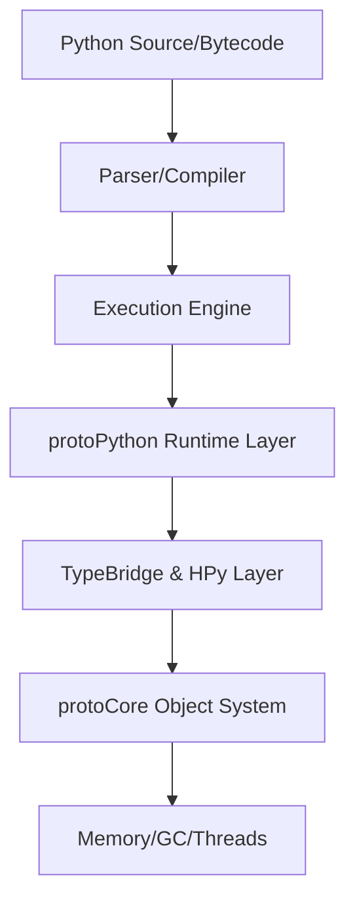

# protoPython: GIL-Free Python 3.14 Runtime

[](https://isocpp.org/)
[](https://cmake.org/)
[]()
[-brightgreen.svg)]()
[](LICENSE)

> **"The GIL is no longer a limit. Immutability is no longer a constraint. Welcome to the era of the Swarm of One."**

**protoPython** is a Python 3.14 compatible environment built from the ground up on top of [**protoCore**](https://github.com/numaes/protoCore). It delivers a parallel Python runtime that eliminates the Global Interpreter Lock (GIL) and leverages immutable data structures for thread safety. The current focus is correctness: all 17 CPython conformance test categories pass. Interpreter throughput optimization is the active next phase.

> [!IMPORTANT]
> **protoPython**, **protopy**, and **protopyc** are now **Ready for community review**. We invite the community to audit the architecture, test edge cases, and provide performance feedback. The compiler now supports full C++ translation with incremental collection building and runtime support.

---

## 🎯 Key Features

- **True Parallel Concurrency (GIL-Free)**: Each Python thread is a native OS thread. Based on protoCore's parallel architecture, protoPython executes Python code across multiple cores without the bottlenecks of a Global Interpreter Lock.
- **Immutable Core Integrity**: Leverages protoCore's immutable-by-default memory model. Objects like tuples, strings, and collections utilize structural sharing, making them thread-safe by design and eliminating a whole class of concurrency bugs.
- **Zero-Copy Interop (UMD & HPy)**: The **Unified Memory Bridge (UMD)** and full **HPy** support enable passing massive data buffers between Python and C++ libraries without a single pointer move or data copy.
- **Hardware-Aware Design**: Optimized for modern CPU architectures with 64-byte cell alignment, eliminating false sharing and maximizing cache locality.
- **Python 3.14 Compatibility**: Targets the latest Python feature set, including advanced syntax and built-in type behaviors.

---

## 📋 Project Status: Phase 7 Support ✅

**Current Status:** Ready for community review (protoPython, protopy). Work in Progress (protopyc).

| Metric | Status |
|--------|--------|
| **Core Runtime** | **Complete** - GIL-free execution engine ✅ |
| **Type System** | **Advanced** - Lists, Tuples, Sets, Dicts with native wrapping ✅ |
| **C++ Interop** | **Full** - HPy and UMD support integrated ✅ |
| **Compiler** | **Advanced** - Full C++ translation with collection support ✅ |
| **Performance** | **Optimization in Progress** - V154 active: 256-shard mutable cache with negative caching, frame-skip restored for CO_OPTIMIZED leaf calls, attribute-name lookup avoids `toUTF8String` allocations. Geomean **7.30×** vs CPython 3.14 (Release build, minimum of 10). ⚙️ |
| **CPython Conformance** | **100%** - 17/17 test categories passing (Essential, Important, Necessary) ✅ |

- ✅ **Generator Delegation**: Full support for `yield` and `yield from` with efficient state persistence.
- ✅ **Smart Collection Unwrapping**: Seamless bridge between Python objects and native C++ collection methods.
- ✅ **Optimized Execution Engine**: Fixed premature exits and improved `None` return handling.
- ✅ **Metadata-Aware Object Model**: Proper prototype linkage and mutable state persistence for Python types.
- ✅ **Enhanced Debugging**: Integrated diagnostic systems for deep runtime analysis.
- ✅ **Balanced Collection Core**: `ProtoList` uses AVL balancing for $O(\log N)$ stability.
- ✅ **Optimized String Ropes**: High-performance string concatenation using native `protoCore` ropes.
- ✅ **Core Language Completeness**: Full support for Slicing, `del` statement, and `assert` functionality integrated.
- ✅ **Variable Arguments Support**: Full implementation of `*args` and `**kwargs` with support for both function definitions and calls, including correct dictionary key string representation.

---

## 📊 Performance Benchmarks (V154)

End-to-end script timings on the same machine, same kernel, governor,
Release build (`-O3 -DNDEBUG`).  Methodology: 2 warmup runs +
**minimum of 10 timed runs** per side per benchmark, which resists
scheduler / contention spikes.  CPython reference is `python3` (CPython 3.14).

```
┌────────────────────────┬──────────────┬──────────────┬─────────────────┬────────────────┐
│ Benchmark              │ protoPy (ms) │ CPython (ms) │ Ratio           │ Note           │
├────────────────────────┼──────────────┼──────────────┼─────────────────┼────────────────┤
│ startup_empty          │      32.0    │      32.0    │ 1.00× same      │ floor          │
│ int_sum_loop           │      32.1    │      32.3    │ 1.00× same      │ pure SmallInt  │
│ list_append_loop       │    1067.0    │      64.5    │ 16.55× slower   │                │
│ str_concat_loop        │     766.3    │      64.3    │ 11.91× slower   │                │
│ range_iterate          │     615.8    │      64.3    │  9.58× slower   │                │
│ multithreaded_cpu      │    1217.3    │      64.4    │ 18.90× slower   │ ⚠ should win   │
│ attr_lookup            │    1016.5    │      64.3    │ 15.81× slower   │                │
│ call_recursion         │     916.3    │      64.4    │ 14.22× slower   │ fib(25) 242k   │
├────────────────────────┼──────────────┼──────────────┼─────────────────┼────────────────┤
│ Geomean Time Ratio     │              │              │  7.30×          │                │
└────────────────────────┴──────────────┴──────────────┴─────────────────┴────────────────┘
```

Detail and methodology:
[`benchmarks/reports/2026-04-25-mutable-cache.md`](benchmarks/reports/2026-04-25-mutable-cache.md).

### What landed in V154

- **256-shard `mutableRoot` with cache-line padding** in protoCore.
  Selection by `mutable_ref % 256`, each slot padded to 64 bytes inside
  an `alignas(64)` array so concurrent CASes on different shards don't
  thrash a shared line.
- **Per-thread mutable-value cache (`MutableValueCacheEntry[1024]`)**
  in `ProtoThreadExtension`.  Validation by shard-root pointer
  equality, so any successful CAS by any thread invalidates stale
  entries on the next lookup with no broadcast.  Stores **negative
  results** too: an unmutated mutable now pays AVL only on the first
  read; subsequent reads on the same thread return immediately.
- **`skipFrame` restored for CO_OPTIMIZED leaf calls** in both
  `runUserFunctionCall` and the `runUserFunctionCallRaw` fast path.
  `b35bf811` had unconditionally built a frame on every call, which
  drove `call_recursion` to 35 s.  After the fix it is **0.97 s**.
- **`PythonEnvironment::getAttribute` no longer allocates `std::string`
  in the keys-fallback path.**  Replaced
  `keyS->toUTF8String(...) == name->toUTF8String(...)` with the
  zero-allocation `keyS->cmp_to_string(ctx, name)`.  Five hot sites
  fixed; ~5-15 % wall-time reduction across attribute-bound
  benchmarks.

### Where the remaining gap is

Latest DWARF profile of `list_append_loop` (Release, post-V154):

```
 5.4 %  proto::ProtoString::toUTF8String           ← name path elsewhere
 3.6 %  proto::RopeCharacterIterator::next
 3.3 %  proto::StringLeafNode::fromObject
 2.4 %  proto::ProtoSpace::getFreeCells             (was 46 % pre-fix)
 2.4 %  proto::ProtoObject::getAttribute
 2.3 %  proto::ProtoObject::isString
 2.0 %  __memmove_avx_unaligned_erms
 1.9 %  proto::ProtoSparseListImplementation::implGetAt
```

Allocator pressure dropped from 46 % to 2.4 %.  Remaining
`toUTF8String` calls are in diagnostic paths and exception-name
checks, not the hot per-instruction loop.

### Roadmap to approach and surpass CPython

In priority order:

| Tier | Item | Status | Expected impact |
|---|---|---|---|
| **1** | Eliminate `toUTF8String` in `getAttribute` keys fallback | ✅ landed | -5 to -15 % |
| **1** | Lazy frame materialisation for `sys._getframe()` consumers | ⚙ deferred (design) | low single-digit |
| **2** | Inline SmallInteger arithmetic on the bytecode hot path | planned | 20-40 % on integer loops |
| **2** | Lock-free per-context cell pool replenish | planned | 1-2 % single-thread, larger as cores grow |
| **3** | Fix `multithread_cpu` regression — the GIL-free architectural win | planned | should beat CPython |
| **3** | Verify GC scaling on N=2,4,8 threads | planned | confirms #3 |
| **4** | JIT compile hot bytecode regions via the `co_bytecode_native` path | research | crosses 1.0× threshold |

The marquee follow-up is **Tier 3**: `multithread_cpu` is *worse* than
CPython today (1217 ms vs 64 ms), not better.  GIL-free is the whole
point of the architecture; the benchmark currently spends its budget
on `globalMutex` contention in `getFreeCells` and per-context
`new DirtySegment` mallocs.  When that lands, this is the benchmark
where protoPython decisively beats CPython.

---

## �🚀 Quick Start

### Build and Install
For detailed, platform-specific instructions (including install prefix and library path), see the [**Installation Guide**](docs/INSTALLATION.md).

```bash
# Clone protoPython and protoCore (protoCore can be a sibling directory or installed separately)
git clone https://github.com/numaes/protoPython.git
cd protoPython
git clone https://github.com/numaes/protoCore.git ../protoCore

# Configure and build (install is optional; see docs for install location and prefix)
cmake -B build -S .
cmake --build build
# Optional: install to a prefix (default /usr/local; use -DCMAKE_INSTALL_PREFIX=... for a local install)
# cmake --build build --target install
```

**Running without installing:** You can run from the build tree; RPATH is set so the executables find the shared libraries without setting `LD_LIBRARY_PATH` or `DYLD_LIBRARY_PATH`. See the [Installation Guide](docs/INSTALLATION.md#running-from-the-build-tree).

### Run a Python Script
```python
# example.py
l = [1, 2]
l.append(3)
print("Updated list:", l)

s = "Hello World"
print("Starts with 'Hello':", s.startswith("Hello"))
```

Execute it with `protopy` (from the build tree or from your `PATH` after install):
```bash
# From build tree (see Installation Guide for library path on macOS/Linux)
./build/src/runtime/protopy example.py
# Or, after install: protopy example.py
```

---

## 🏗️ Components

- **protopy**: The primary GIL-less Python 3.14 execution environment. (**Ready for community review**)
- **libprotoPython**: The shared library providing the Python runtime environment for embedding in C++ applications. (**Ready for community review**)
- **protopyc**: A specialized compiler that translates Python modules into high-performance C++ shared libraries based on `protoCore`. (**Ready for community review**)

---

## 🏗️ Architecture


```mermaid
graph TD
    A[Python Source/Bytecode] --> B[Parser/Compiler]
    B --> C[Execution Engine]
    C --> D[protoPython Runtime Layer]
    D --> E[TypeBridge & HPy Layer]
    E --> F[protoCore Object System]
    F --> G[Memory/GC/Threads]
```

---

## The Swarm of One

**The Swarm of One** enables a paradigm shift in software development. In protoPython, we transitioned from core infrastructure to a fully functional, highly parallel runtime in record time. By orchestrating a swarm of specialized AI agents, a single architect has built a GIL-less environment where Python objects share the same 64-byte cell DNA as protoCore and protoJS. This is the democratization of high-level engineering: bridging language paradigms without the traditional overhead of massive R&D teams.

---

## The Methodology: AI-Augmented Engineering

This project was built using **extensive AI-augmentation tools** to empower human vision and strategic design. This is not "AI-generated code" in the traditional sense; it is **AI-amplified architecture**. The vision, the constraints, and the trade-offs are human; the execution is accelerated by AI as a force multiplier for complex system design. We embrace AI as the unavoidable present of software engineering.

---

## 📚 Documentation

- [**User Guide**](docs/USER_GUIDE.md) — Comprehensive guide for Python developers.
- [**Python Compatibility**](docs/PYTHON_COMPATIBILITY.md) — Supported features and differences from CPython.
- [**C++ API Reference**](docs/CPP_API_REFERENCE.md) — Documentation for embedding and native extensions.
- [**Internals Deep Dive**](docs/INTERNALS_DEEP_DIVE.md) — Technical exploration of the GIL-free runtime.
- [**Design Decisions**](docs/DESIGN_DECISIONS.md) — Architectural rationale and history.
- [**Installation Guide**](docs/INSTALLATION.md) — Platform-specific build instructions.
- [**HPy Guides**](docs/HPY_USER_GUIDE.md) — Loading and developing HPy extensions.
- [**Regression Audit**](docs/EXECUTION_ENGINE_REGRESSIONS.md) — Record of execution engine fixes.

---

## License & Author

Copyright (c) 2026 Gustavo Marino <gamarino@gmail.com>

Licensed under the **MIT License**. See the [LICENSE](LICENSE) file for details.

---

## Lead the Shift

**Lead the Shift.** Don't just watch the Python ecosystem evolve—be the one who drives it. Join the review, test the GIL-less performance, and become part of the Swarm of One. **Think Different, As All We.**

